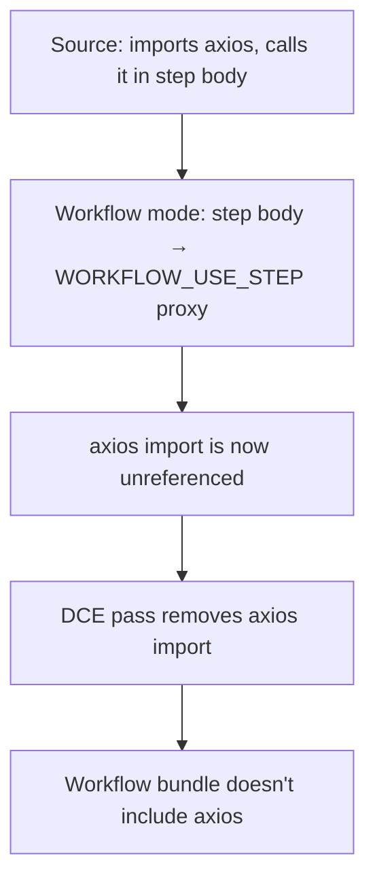
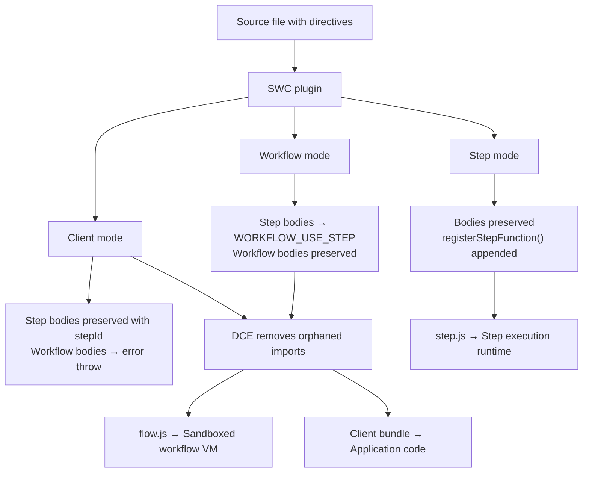

Most durable execution frameworks ask you to do one of two things: either write your code in a special DSL that the runtime understands, or manually separate your orchestration logic from your side effects into different files with explicit registrations.

Workflow DevKit takes a different approach. You write one file. You add directives — `"use step"` and `"use workflow"` — to your functions. The compiler does the rest.

Behind those two simple strings is an SWC compiler plugin that produces three distinct JavaScript bundles from the same source, each serving a different execution context. This article walks through exactly how that transformation works, what each mode produces, and why the design decisions matter.

## The Three Modes

The plugin runs three separate passes over each workflow file:

| Mode | Who consumes it | What happens to step bodies | What happens to workflow bodies |
|------|----------------|-----------------------------|-------------------------------|
| **Step** | Step execution runtime | Preserved intact | Replaced with error throws |
| **Workflow** | Sandboxed VM | Replaced with `WORKFLOW_USE_STEP` proxy calls | Preserved intact |
| **Client** | Your application code | Preserved (with `stepId` attached) | Replaced with error throws |

Each mode answers a different question:
- Step mode: "What code should run when a step executes?"
- Workflow mode: "What code should run inside the deterministic replay VM?"
- Client mode: "How does application code reference workflows without executing them?"

Let's look at a concrete example. Here's a source file:

```ts
export async function createUser(email: string) {
  "use step";
  return { id: crypto.randomUUID(), email };
}

export async function handleUserSignup(email: string) {
  "use workflow";
  const user = await createUser(email);
  return { userId: user.id };
}
```

Now let's see what each mode produces.

## Step Mode: Preserve and Register

Step mode keeps step function bodies exactly as written — they need full Node.js access to call APIs, query databases, and perform side effects. The plugin strips the directive, appends a `registerStepFunction()` call, and replaces workflow bodies with error stubs:

```ts
// Step mode output
import { registerStepFunction } from "workflow/internal/private";

export async function createUser(email) {
  // Body preserved exactly as written
  return { id: crypto.randomUUID(), email };
}
registerStepFunction("step//./workflows/user//createUser", createUser);

// Workflow functions throw — they belong in the flow bundle
export async function handleUserSignup(email) {
  throw new Error(
    "You attempted to execute workflow handleUserSignup function directly. " +
    "To start a workflow, use start(handleUserSignup) from workflow/api"
  );
}
handleUserSignup.workflowId = "workflow//./workflows/user//handleUserSignup";
```

The `registerStepFunction` call links the step ID to its implementation so the step execution runtime can look it up when a queue message arrives. The step ID is the same in all three modes — we'll see how it's generated shortly.

## Workflow Mode: The Central Transformation

This is where the magic happens. Workflow mode replaces step function bodies with proxy calls through `globalThis[Symbol.for("WORKFLOW_USE_STEP")]` — a well-known symbol that the runtime binds to the `useStep` function inside the sandboxed VM:

```ts
// Workflow mode output
export var createUser = globalThis[Symbol.for("WORKFLOW_USE_STEP")](
  "step//./workflows/user//createUser"
);

// Workflow body preserved — deterministic orchestration
export async function handleUserSignup(email) {
  const user = await createUser(email);
  return { userId: user.id };
}
handleUserSignup.workflowId = "workflow//./workflows/user//handleUserSignup";
globalThis.__private_workflows.set(
  "workflow//./workflows/user//handleUserSignup",
  handleUserSignup
);
```

When the workflow VM calls `await createUser(email)`, it's actually calling through the `WORKFLOW_USE_STEP` proxy. That proxy consults the `EventsConsumer`: if a matching `step_completed` event exists in the log, it returns the cached result. If not, it adds the step to the pending invocations queue and throws a `WorkflowSuspension` to exit the VM.

The transformation is why workflows are deterministic. The original step body — the one that calls `crypto.randomUUID()` — is gone. In its place is a proxy that returns cached results from the event log. Same inputs, same outputs, every replay.

The `__private_workflows.set()` call registers the workflow function so the runtime can find it by ID when a queue message arrives.

### What about the runtime side?

The `WORKFLOW_USE_STEP` symbol is injected in `packages/core/src/workflow.ts`:

```ts
// From packages/core/src/workflow.ts
const useStep = createUseStep(workflowContext);
// @ts-expect-error — `@types/node` says symbol is not valid, but it does work
vmGlobalThis[WORKFLOW_USE_STEP] = useStep;
```

The `createUseStep` function in `packages/core/src/step.ts` returns a factory that, given a step ID, produces a function. That function subscribes to the `EventsConsumer`, checks for cached results, and either resolves the promise or triggers suspension.

## Client Mode: Safe References

Client mode ensures application code can reference workflows (to pass to `start()`) without accidentally executing them:

```ts
// Client mode output
export async function handleUserSignup(email) {
  throw new Error(
    "You attempted to execute workflow handleUserSignup function directly. " +
    "To start a workflow, use start(handleUserSignup) from workflow/api"
  );
}
handleUserSignup.workflowId = "workflow//./workflows/user//handleUserSignup";
```

The `workflowId` property is what `start()` reads to know which workflow to launch. The error stub prevents the common mistake of calling `await handleUserSignup(email)` directly — which would bypass the entire durable execution model.

Step functions in client mode keep their bodies intact (for local testing) and have a `stepId` property attached directly. Unlike step mode, client mode doesn't import `registerStepFunction` — that module has server-side dependencies that shouldn't appear in client bundles.

## Stable ID Generation

The compiler generates deterministic IDs from two inputs: the module path and the function name. The pattern is:

```
{type}//{modulePath}//{identifier}
```

Where:
- **type** is `workflow`, `step`, or `class`
- **modulePath** is a relative path prefixed with `./` (e.g., `./workflows/user-signup`) — file extensions are stripped. When a module specifier with version is configured, it uses that instead (e.g., `@myorg/tasks@2.0.0`)
- **identifier** is the function name, with nested functions using `/` separators and class members using `.` (static) or `#` (instance)

Examples:
```
workflow//./workflows/user-signup//handleUserSignup
step//./workflows/user-signup//createUser
step//./src/jobs/order//processOrder/innerStep      (nested step)
step//./src/jobs/order//MyClass.staticMethod         (static method)
step//./src/jobs/order//MyClass#instanceMethod        (instance method)
```

IDs are stable across builds and deployments — they only change if you rename a file or function. The same ID is generated in all three modes, so step mode's `registerStepFunction()`, workflow mode's `WORKFLOW_USE_STEP` proxy, and client mode's `workflowId`/`stepId` all agree on the identity of each function.

This stability is what makes durable execution work across deploys. A workflow that suspended before a deploy resumes with new code, but the step IDs in the event log still match the new code's step registrations.

## Nested Steps and Closures

Steps defined inside workflow functions get special treatment. Consider:

```ts
export async function myWorkflow(config: Config) {
  "use workflow";
  let count = 0;

  async function increment() {
    "use step";
    count++;
    return count;
  }

  return await increment();
}
```

In workflow mode, the nested step becomes an inline `WORKFLOW_USE_STEP` call with a closure function:

```ts
// Workflow mode — nested step with closure
export async function myWorkflow(config) {
  let count = 0;

  var increment = globalThis[Symbol.for("WORKFLOW_USE_STEP")](
    "step//./input//myWorkflow/increment",
    () => ({ count })  // Closure variables serialized at call time
  );

  return await increment();
}
```

The second argument to `WORKFLOW_USE_STEP` captures the variables the nested step needs. On the step side, the hoisted function retrieves these via `__private_getClosureVars()`. The ID includes the parent function name: `myWorkflow/increment`.

Steps can also nest inside deeply nested object properties. The plugin recursively walks the AST, generating compound path-based IDs like `step//./input//vade/tools/VercelRequest/execute` and hoisting the functions with `$`-separated variable names.

## Dead Code Elimination

After replacing step bodies in workflow mode (or workflow bodies in client mode), the original code's imports and helpers become orphaned. A helper function only called from a step body is now unreachable — the step body was replaced with a proxy call.

The plugin runs a DCE (dead code elimination) pass that removes these unreachable references:



This matters for bundle size and correctness. Without DCE, the workflow bundle would try to import server-side dependencies like database drivers or HTTP clients — modules that don't belong in the sandboxed VM. The DCE pass ensures that only code reachable from the surviving function bodies makes it into the final bundle.

## Build-Time Validation

The plugin validates directive usage during compilation, catching mistakes before deployment:

| Error | What it catches |
|-------|----------------|
| Non-async function | `"use step"` or `"use workflow"` on a synchronous function |
| Instance methods with `"use workflow"` | Only static methods can be workflows |
| Misplaced directive | Directive not at the top of the file or start of the function body |
| Conflicting directives | Both `"use step"` and `"use workflow"` at module level |
| Invalid exports | Module-level directive files can only export async functions |
| Misspelled directive | Catches typos like `"use steps"` or `"use workflows"` |

These are build-time errors, not runtime surprises. If you misspell a directive, you find out during `next build`, not at 2 AM when the production workflow fails silently.

## Before and After: Manual Separation vs. Compiler-Driven

Consider a traditional approach where the developer must manually maintain the separation:

**Manual separation:**
- Step functions live in one file, workflow logic in another, client references in a third
- Step IDs are manually defined strings — typos cause silent failures at runtime
- Renaming a function requires updating the ID in every file that references it
- Imports must be manually managed to avoid pulling server-side code into client bundles
- No build-time validation — misconfigurations surface as runtime errors

**Compiler-driven transformation:**
- One file. Two directives. Three bundles generated automatically
- IDs are derived from file path and function name — deterministic, stable, no manual management
- Rename a function and the ID changes everywhere in the next build
- DCE eliminates orphaned imports from replaced function bodies
- Build-time validation catches structural errors before deployment

The compiler is the mechanism that makes the programming model feel like writing normal JavaScript while providing the runtime guarantees that durable execution requires.

## What Happens at Runtime

The three bundles are consumed by different parts of the Workflow DevKit infrastructure:

**Step bundle** → loaded by the step execution handler when a queue message arrives. The handler parses the queue payload — which carries `workflowName`, `workflowRunId`, `workflowStartedAt`, `stepId`, and trace metadata — then emits a `step_started` event, hydrates the step's input from the persisted `step_created` event (not from the queue message), executes the function, and persists the result as a `step_completed` event. The queue message is a lightweight trigger; the event log is what makes execution durable.

```ts
// From packages/core/src/runtime/suspension-handler.ts — queue payload shape
await queueMessage(
  world,
  `__wkf_step_${queueItem.stepName}`,
  {
    workflowName,
    workflowRunId: runId,
    workflowStartedAt,
    stepId: queueItem.correlationId,
    traceCarrier,
    requestedAt: new Date(),
  },
  {
    idempotencyKey: queueItem.correlationId,
  }
);
```

**Workflow bundle** → loaded into the sandboxed VM when the workflow handler is invoked. The `WORKFLOW_USE_STEP` symbol is bound to the runtime's `useStep` proxy, and `__private_workflows` is a `Map` that the runtime reads to find the workflow function by ID. The VM environment patches `Math.random()`, `Date.now()`, `crypto.getRandomValues()`, and `crypto.randomUUID()` with deterministic, seeded alternatives — making all workflow code replay-safe. Step bodies are excluded from the workflow bundle not because they need "real" randomness, but because they perform side effects (API calls, database writes, file I/O) that must not re-execute during replay.

**Client bundle** → imported by your application code. When you write `import { handleUserSignup } from './workflows/user'`, you get the client-mode output — a function with a `workflowId` property. Calling `start(handleUserSignup)` reads that property to construct the queue message. The error-throwing body ensures that a stray `await handleUserSignup(email)` in your application code throws a helpful message instead of silently bypassing durable execution.

The three bundles are placed in predictable locations by the framework integration:
- Step: `.well-known/workflow/v1/step`
- Workflow: `.well-known/workflow/v1/flow`
- Client: your normal import paths

This convention means the runtime can discover and load bundles without any explicit registration or configuration beyond the directives themselves.

## The Full Pipeline



## Conclusion

The SWC plugin is the bridge between the programming model and the runtime model. It lets you write code that looks and feels like ordinary JavaScript — functions, imports, `async`/`await` — while producing the three specialized bundles that the durable execution runtime needs. Stable IDs ensure consistency across modes. DCE keeps bundles clean. Build-time validation catches errors early.

One file. Two directives. Three bundles. Zero manual plumbing.
