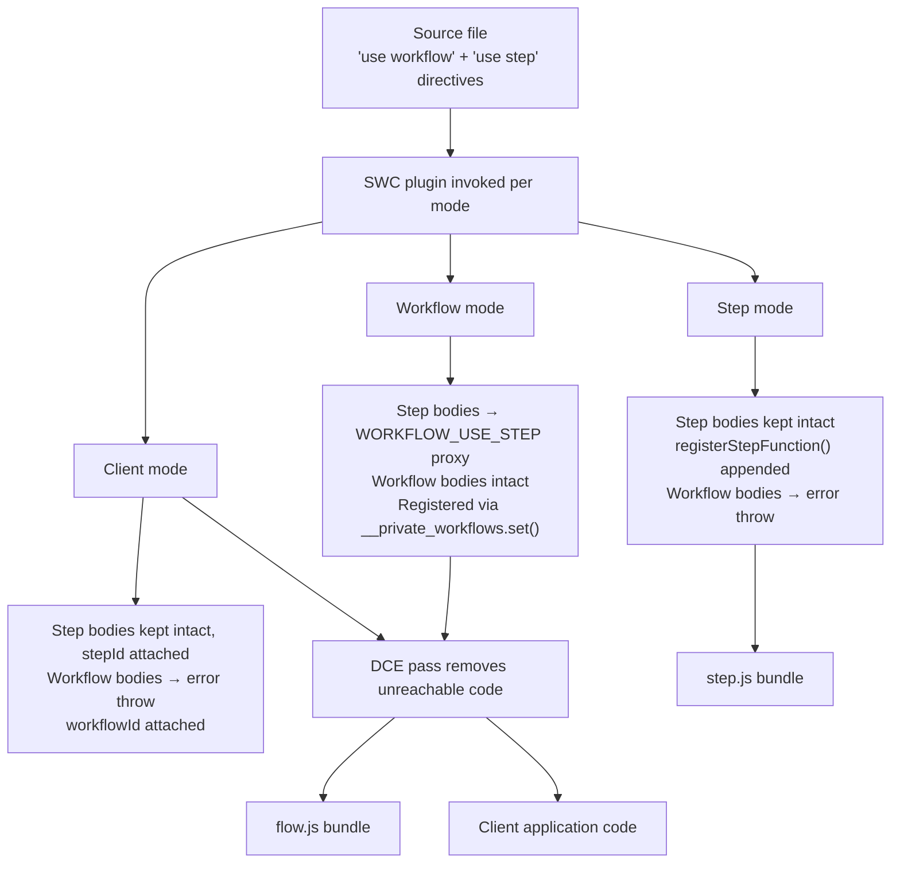

<Callout>
The SWC compiler plugin is the mechanism that makes the directive-based programming model work. It takes a single source file containing `"use workflow"` and `"use step"` functions and produces three distinct outputs — one for step execution, one for workflow orchestration, and one for client-side references. Without this transformation, the runtime would have no way to separate side-effecting step bodies from deterministic workflow logic, and developers would need to manually split their code across files and maintain separate ID registries.
</Callout>

## Overview

The Workflow DevKit compiler is an SWC plugin that operates in three modes, each producing a different transformation of the same source file:

| Mode     | Purpose                                    | Output bundle                      | Key transformation                                |
|----------|--------------------------------------------|------------------------------------|---------------------------------------------------|
| Step     | Bundles step function bodies for execution | `.well-known/workflow/v1/step`     | Bodies kept intact, registered via `registerStepFunction()` |
| Workflow | Bundles orchestration logic for the VM     | `.well-known/workflow/v1/flow`     | Step bodies replaced with `WORKFLOW_USE_STEP` proxy calls   |
| Client   | Provides type-safe workflow references     | Your application code              | Workflow bodies replaced with error throws, `workflowId` attached |

All three modes emit a JSON manifest comment at the top of the output containing metadata about discovered workflows, steps, and serializable classes. This manifest is consumed by bundlers and the runtime to discover and register functions.

## Lifecycle

The following diagram shows how a single source file is transformed into three execution targets:



After the workflow-mode and client-mode transforms, the plugin runs a dead code elimination (DCE) pass. In workflow mode, because step bodies are replaced with proxy calls, imports and helper functions that were only referenced from those original step bodies become unreachable and are removed. In client mode, the same pruning applies to code reachable only from workflow bodies that were replaced with error stubs. Exports and identifiers still referenced by the surviving code are preserved.

## Code Walkthrough

### Step mode: register and preserve

In step mode, step function bodies are kept completely intact — they execute with full Node.js runtime access. The plugin strips the directive, appends a `registerStepFunction()` call, and attaches an error-throwing stub to any workflow functions (since workflows should never execute directly in the step bundle):

```ts title="Step mode output (from spec.md)" lineNumbers
import { registerStepFunction } from "workflow/internal/private";

export async function createUser(email) {
  // Body preserved exactly as written
  return { id: crypto.randomUUID(), email };
}
registerStepFunction("step//./workflows/user//createUser", createUser);

// Workflow functions throw in step mode — they belong in the flow bundle
export async function handleUserSignup(email) {
  throw new Error(
    "You attempted to execute workflow handleUserSignup function directly. " +
    "To start a workflow, use start(handleUserSignup) from workflow/api"
  );
}
handleUserSignup.workflowId = "workflow//./workflows/user//handleUserSignup";
```

### Workflow mode: step proxy replacement

This is the central transformation. Step function bodies are replaced with calls through `globalThis[Symbol.for("WORKFLOW_USE_STEP")]` — a well-known symbol bound to the runtime's `useStep` function inside the sandboxed VM. Workflow function bodies are left intact because they contain deterministic orchestration logic that must replay identically:

```ts title="Workflow mode output (from spec.md)" lineNumbers
// Step body replaced — the runtime proxy checks the event log
// and either returns a cached result or triggers suspension
export var createUser = globalThis[Symbol.for("WORKFLOW_USE_STEP")](
  "step//./workflows/user//createUser"
);

// Workflow body preserved — deterministic orchestration
export async function handleUserSignup(email) {
  const user = await createUser(email);
  return { userId: user.id };
}
handleUserSignup.workflowId = "workflow//./workflows/user//handleUserSignup";
globalThis.__private_workflows.set(
  "workflow//./workflows/user//handleUserSignup",
  handleUserSignup
);
```

At runtime, when the workflow calls `await createUser(email)`, the `WORKFLOW_USE_STEP` proxy consults the `EventsConsumer`. If a matching `step_completed` event exists in the log, it returns the cached result. If not, it adds the step to the pending invocations queue and eventually throws a `WorkflowSuspension` to exit the VM.

### Client mode: error stubs with workflow IDs

Client mode prevents direct execution of workflow functions while preserving the `workflowId` property that `start()` needs to identify which workflow to launch:

```ts title="Client mode output (from spec.md)" lineNumbers
// Workflow body replaced with error throw
export async function handleUserSignup(email) {
  throw new Error(
    "You attempted to execute workflow handleUserSignup function directly. " +
    "To start a workflow, use start(handleUserSignup) from workflow/api"
  );
}
// workflowId attached — same value as workflow mode
handleUserSignup.workflowId = "workflow//./workflows/user//handleUserSignup";
```

Step functions in client mode keep their bodies intact (allowing local testing) and have their `stepId` property set directly on the function — unlike step mode, client mode does not import `registerStepFunction` because that module contains server-side dependencies.

<Callout type="info">
Client mode is optional but recommended. Without it, you must manually construct workflow IDs using the `{type}//{modulePath}//{functionName}` pattern or look them up in the build manifest. All framework integrations include client mode as a loader by default.
</Callout>

### Stable ID generation

The compiler generates deterministic IDs from the module path and function name using the pattern:

```
{type}//{modulePath}//{identifier}
```

Where:
- **type** is `workflow`, `step`, or `class`
- **modulePath** is either a module specifier with version (e.g., `@myorg/tasks@2.0.0`) when configured, or a relative path prefixed with `./` (e.g., `./src/jobs/order`) — file extensions are stripped
- **identifier** is the function name, with nested functions using `/` separators and class members using `.` (static) or `#` (instance)

Examples:
- `workflow//./workflows/user-signup//handleUserSignup`
- `step//./workflows/user-signup//createUser`
- `step//./src/jobs/order//processOrder/innerStep` (nested step)
- `step//./src/jobs/order//MyClass.staticMethod` (static method)
- `step//./src/jobs/order//MyClass#instanceMethod` (instance method)

IDs are stable: they don't change unless you rename files or functions. The same ID is generated in all three modes for the same function, ensuring that step mode's `registerStepFunction()`, workflow mode's `WORKFLOW_USE_STEP` proxy, and client mode's `workflowId`/`stepId` property all agree.

### Nested step handling

Steps defined inside workflow functions are hoisted to module level with compound names. In step mode, the nested function is extracted and registered independently. In workflow mode, the nested step becomes an inline `WORKFLOW_USE_STEP` call with an optional closure function:

```ts title="Nested step — workflow mode output (from spec.md)" lineNumbers
export async function myWorkflow(config) {
  let count = 0;

  // Nested step replaced with proxy — closure function captures `count`
  var increment = globalThis[Symbol.for("WORKFLOW_USE_STEP")](
    "step//./input//myWorkflow/increment",
    () => ({ count })  // Closure variables serialized at call time
  );

  return await increment();
}
myWorkflow.workflowId = "workflow//./input//myWorkflow";
globalThis.__private_workflows.set("workflow//./input//myWorkflow", myWorkflow);
```

The second argument to `WORKFLOW_USE_STEP` is a closure function that captures the variables the nested step needs. On the step side, the hoisted function retrieves these variables via `__private_getClosureVars()`.

Steps can also be defined inside deeply nested object properties. The plugin recursively walks the AST to find step-annotated functions, generating compound path-based IDs (e.g., `step//./input//vade/tools/VercelRequest/execute`) and hoisting them with `$`-separated variable names (e.g., `vade$tools$VercelRequest$execute`).

### Build-time validation

The plugin validates directive usage during compilation and emits errors for invalid patterns:

| Error | Description |
|-------|-------------|
| Non-async function | Functions with `"use step"` or `"use workflow"` must be async |
| Instance methods with `"use workflow"` | Only static methods can have `"use workflow"` |
| Misplaced directive | Directive must be at the top of the file or start of the function body |
| Conflicting directives | Cannot have both `"use step"` and `"use workflow"` at module level |
| Invalid exports | Module-level directive files can only export async functions |
| Misspelled directive | Detects typos like `"use steps"` or `"use workflows"` |

The workflow-mode transformation also validates that workflow code doesn't import modules that would break determinism — like `fs`, `http`, or `child_process`. Most invalid patterns are caught as build-time errors before deployment.

## Why This Matters

The three-mode transformation is what enables writing workflows as ordinary JavaScript functions while gaining durable execution:

1. **Single source of truth** — developers write one file. The compiler handles the separation of concerns, eliminating an entire class of consistency bugs where step registrations, workflow IDs, or function signatures could drift.

2. **Correct by construction** — build-time validation catches invalid patterns (non-async functions, misplaced directives, forbidden imports) before code reaches production. The DCE pass ensures that workflow and client bundles don't carry dead code from replaced function bodies.

3. **Stable, portable identifiers** — IDs derived from module path and function name are deterministic across builds, deployments, and runtime environments. Renaming a file changes the ID, but the build process surfaces this as a manifest change rather than a silent runtime failure.
