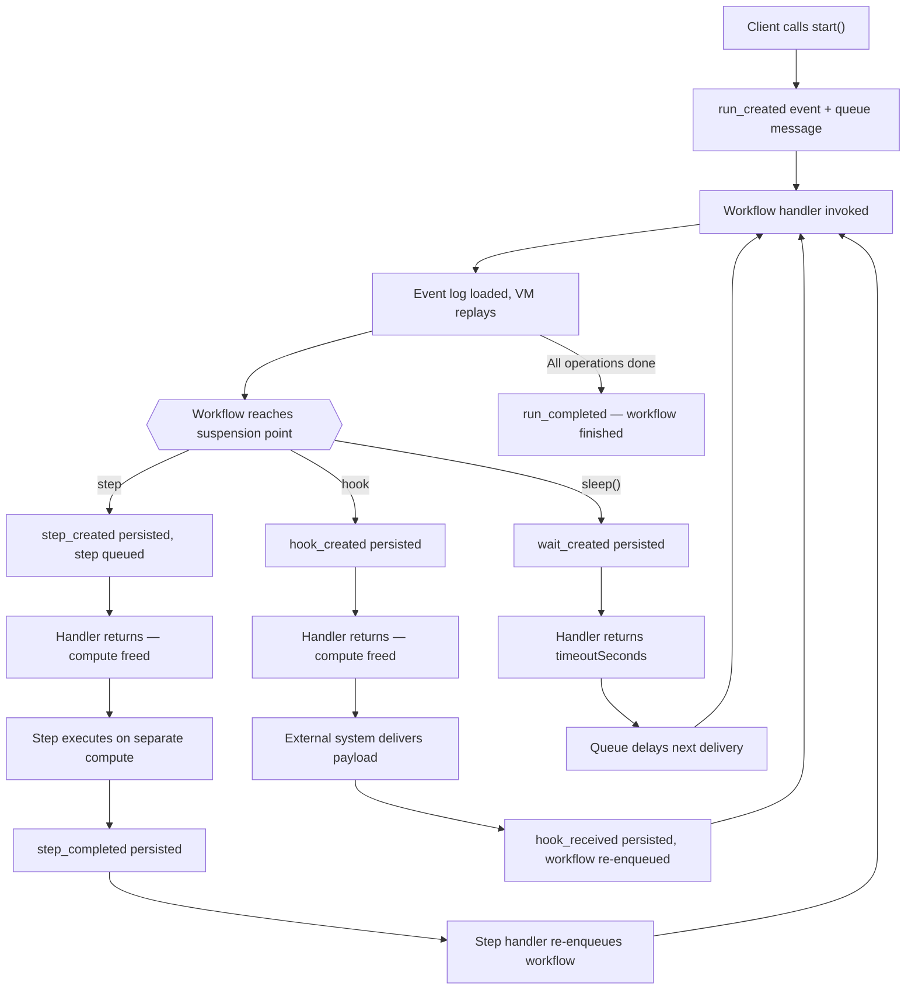

Here's a workflow that sends an onboarding email, waits 3 days for the user to activate, sends a reminder if they haven't, waits another 4 days, then marks the account for cleanup.

In a traditional system, that workflow ties up a worker process for a week. The process sits idle for 168 hours, doing nothing, costing money.

In Workflow DevKit, that same workflow consumes compute only in a handful of brief invocations spread across seven days. No worker process stays resident between those decision points. Event writes and queue operations still occur at the suspension boundaries, but the runtime does not hold compute open while the workflow is waiting. The state lives in durable events and queued wake-ups, not in a running machine.

This article explains how that works: the queue-driven execution model, the suspension mechanics, and the delayed re-enqueue infrastructure that makes wall-clock time effectively free.

## The Core Insight: Run Only When There's Work

<Callout type="info">
**Think in decision points, not duration.** A 7-day workflow with 4–6 decision points consumes compute only when it starts, dispatches work, resumes after external completion, or finishes. The 168 hours between those points are represented by durable events and delayed queue messages — not a live worker.
</Callout>

The cost model isn't a feature you configure. It's a direct consequence of how the runtime works:

1. **Queue-driven invocation** — workflow handlers run because a queue message arrives, not because a long-lived worker stays alive. No message, no compute.
2. **External-work suspension** — when orchestration hits a step or hook, the handler persists durable state, dispatches any needed work, and returns. Steps resume when the step handler writes `step_completed` and explicitly re-queues the workflow. Hooks stay suspended until external delivery records `hook_received`.
3. **Timed re-entry** — waits persist `wait_created` and resume through `timeoutSeconds`. On Vercel, waits longer than 23 hours chain across multiple delayed messages because single-message delay is capped.

<Callout type="info">
**What "no polling" means here:** the workflow engine does not keep a worker alive and poll while a run is sleeping or waiting on external work. Suspended state lives in durable events plus queued wake-ups. The public `Run.returnValue` helper is separate: it polls run status once per second until the run reaches a terminal state.
</Callout>

A workflow in Workflow DevKit does not stay alive while it waits. Step, hook, and wait suspension all persist durable state, but they re-enter differently. Steps resume when the step handler writes `step_completed` and explicitly re-enqueues the workflow. Waits resume when the handler returns `timeoutSeconds` and the queue schedules the next delivery. The immediate `timeoutSeconds: 0` edge case is `hook_conflict`, which forces a replay so the hook promise fails deterministically on the next invocation.

These three properties compose into something powerful: a workflow that sleeps for a week consumes compute only during the brief moments when it replays state and dispatches or collects results.

## How a Run Starts

When your application calls `start()`, two things happen:

```ts
// From packages/core/src/runtime/start.ts
const runId = `wrun_${ulid()}`;

// 1. Persist a run_created event — the run now exists in the event log
const result = await world.events.create(
  runId,
  {
    eventType: 'run_created',
    specVersion,
    eventData: {
      deploymentId: deploymentId,
      workflowName: workflowName,
      input: workflowArguments,
      executionContext: { traceCarrier, workflowCoreVersion },
    },
  },
  { v1Compat }
);

// 2. Queue a message to invoke the workflow handler
await world.queue(
  getWorkflowQueueName(workflowName),
  {
    runId,
    traceCarrier,
  } satisfies WorkflowInvokePayload,
  {
    deploymentId,
  }
);

return new Run<TResult>(runId);
```

`start()` returns immediately with a `Run` handle. It does not wait for the workflow to execute. The workflow handler that processes the queued message runs in a separate invocation — potentially on a different compute instance, potentially seconds later.

This is the first cost insight: **starting a workflow doesn't block the caller.** The HTTP request that calls `start()` can return in milliseconds. The workflow itself runs asynchronously.

## Suspension: The Moment Compute Goes to Zero

When the workflow VM encounters a step that hasn't completed, it throws a `WorkflowSuspension` — a structured control-flow signal that collects all pending operations:

```ts
// From packages/core/src/runtime.ts
if (WorkflowSuspension.is(err)) {
  const result = await handleSuspension({
    suspension: err,
    world,
    run: workflowRun,
    span,
    requestId,
  });

  if (result.timeoutSeconds !== undefined) {
    return { timeoutSeconds: result.timeoutSeconds };
  }

  return;
}
```

Inside `handleSuspension`, each pending item is processed:

- **Steps** get a `step_created` event persisted and a queue message dispatched
- **Hooks** get a `hook_created` event — the workflow stays suspended until external delivery records `hook_received`
- **Waits** get a `wait_created` event with a `resumeAt` timestamp

<Callout type="info">
Hooks are durable suspension points, not queued jobs. The create phase records `hook_created`; the receive phase records `hook_received`. Unlike a step, hook creation does not itself queue executable work.
</Callout>

Then the handler calculates the minimum timeout from any pending waits:

```ts
// From packages/core/src/runtime/suspension-handler.ts
const now = Date.now();
const minTimeoutSeconds = waitItems.reduce<number | null>(
  (min, queueItem) => {
    const resumeAtMs = queueItem.resumeAt.getTime();
    const delayMs = Math.max(1000, resumeAtMs - now);
    const timeoutSeconds = Math.ceil(delayMs / 1000);
    if (min === null) return timeoutSeconds;
    return Math.min(min, timeoutSeconds);
  },
  null
);

if (minTimeoutSeconds !== null) {
  return { timeoutSeconds: minTimeoutSeconds };
}

return {};
```

**The handler returns. The compute is freed.** No worker process stays resident between decision points. Event writes and queue operations still happen at the suspension boundaries, but the runtime does not hold compute open while the workflow is waiting. When the next message arrives — whether from a step completion or a delayed re-enqueue — a fresh invocation loads the log and replays from the beginning.

Step, hook, and wait suspension all persist durable state, but they re-enter differently. Steps resume when the step handler writes `step_completed` and explicitly re-enqueues the workflow. Waits resume when the handler returns `timeoutSeconds` and the queue schedules the next delivery. The edge case is `hook_conflict`, which forces an immediate replay with `timeoutSeconds: 0`:

```ts
// packages/core/src/runtime/suspension-handler.ts
if (hasHookConflict) {
  return { timeoutSeconds: 0 };
}
if (minTimeoutSeconds !== null) {
  return { timeoutSeconds: minTimeoutSeconds };
}
return {};
```

```ts
// packages/core/src/runtime/step-handler.ts
await queueMessage(world, getWorkflowQueueName(workflowName), {
  runId: workflowRunId,
  traceCarrier,
  requestedAt: new Date(),
});
```

## Delayed Re-Enqueue: Making Time Free

When `timeoutSeconds` is returned, the queue infrastructure uses it to schedule the next delivery. On Vercel, this is the Queue Service:

```ts
// From packages/world-vercel/src/queue.ts
if (typeof result?.timeoutSeconds === 'number') {
  const delaySeconds =
    result.timeoutSeconds > 0
      ? Math.min(result.timeoutSeconds, MAX_DELAY_SECONDS)
      : undefined;

  // Send new message BEFORE acknowledging current message.
  // Crash safety: if process dies after send but before ack,
  // we get a duplicate invocation but don't lose the scheduled wakeup.
  await queue(queueName, payload, { deploymentId, delaySeconds });
}
```

Two details matter here:

**Maximum delay clamping.** The Vercel Queue Service has a maximum single-message delay of 23 hours. For longer sleeps, the system chains messages automatically. Each time the delayed message fires, the workflow handler checks if `now >= resumeAt`. If the sleep hasn't elapsed, it returns another `timeoutSeconds` and the cycle repeats. A `sleep('30d')` chains approximately 32 delayed messages — each one consuming only the milliseconds of replay compute.

**Crash safety ordering.** The new message is sent *before* the current message is acknowledged. If the process crashes between the send and the acknowledgment, the worst case is a duplicate invocation — not a lost wakeup. The event log's exactly-once guarantees (terminal state enforcement on step completions) handle the duplicate safely.

In local development, the same contract is implemented with `setTimeout`:

```ts
// From packages/world-local/src/queue.ts
if (response.ok) {
  try {
    const timeoutSeconds = Number(JSON.parse(text).timeoutSeconds);
    if (Number.isFinite(timeoutSeconds) && timeoutSeconds >= 0) {
      if (timeoutSeconds > 0) {
        const timeoutMs = Math.min(
          timeoutSeconds * 1000,
          MAX_SAFE_TIMEOUT_MS
        );
        await setTimeout(timeoutMs);
      }
      continue;
    }
  } catch {}
  return;
}
```

## Step Completion: The Wake-Up Call

When a step finishes executing, the step handler re-enqueues the workflow:

```ts
// From packages/core/src/runtime/step-handler.ts
if (EntityConflictError.is(err)) {
  runtimeLogger.debug(
    'Step in terminal state, re-enqueuing workflow',
    {
      stepName,
      stepId,
      workflowRunId,
      error: err.message,
    }
  );

  await queueMessage(world, getWorkflowQueueName(workflowName), {
    runId: workflowRunId,
    traceCarrier: await serializeTraceCarrier(),
    requestedAt: new Date(),
  });

  return;
}
```

This is the mechanism that drives the workflow forward. There's no persistent orchestrator process watching for step completions. Each step completion is a discrete event that triggers exactly one workflow re-invocation. The workflow replays through all completed steps (returning cached results in milliseconds), then continues execution until it either completes or suspends at the next pending operation.

## Run Completion: Clean Exit

When the workflow VM finishes without throwing a `WorkflowSuspension`, the handler persists a `run_completed` event:

```ts
// From packages/core/src/runtime.ts
await world.events.create(
  runId,
  {
    eventType: 'run_completed',
    specVersion: SPEC_VERSION_CURRENT,
    eventData: {
      output: workflowResult,
    },
  },
  { requestId }
);
```

No further messages are queued. No compute resources remain allocated. The workflow is done.

## The Complete Lifecycle



## Before and After: Always-On vs. Queue-Driven

Consider a multi-step order pipeline: charge the card, reserve inventory, send confirmation, wait for shipping notification from a third-party API.

**Always-on orchestration:**
- A worker process stays alive for the entire workflow. If the shipping API takes 6 hours to respond, the worker idles for 6 hours.
- If the process crashes between steps, you need explicit checkpointing, idempotency keys, and manual retry logic.
- Scaling means provisioning enough persistent workers for peak concurrency. Each worker is occupied for the full workflow lifetime, regardless of active vs. idle time.
- A 100-workflow spike requires 100 workers. A workflow that runs for a week occupies one worker for a week.

**Queue-driven execution:**
- The workflow handler runs for milliseconds per invocation. Between steps, nothing exists. The event log is the complete state.
- Crashes are invisible. If the process dies after charging the card, the `step_completed` event is already in the log. On re-invocation, the workflow replays through the cached result and suspends at the next uncompleted step.
- Steps execute as independent queue messages on any available compute. A workflow with 100 concurrent steps (`Promise.all(...)`) dispatches 100 messages — the queue distributes them across available capacity without dedicated workers.
- Wall-clock time doesn't hold a worker open. A `sleep('7d')` and a `sleep('5s')` both produce delayed queue messages and exit. Short waits usually need one delayed delivery; longer waits chain multiple delayed messages (Vercel caps single-message delay at 23 hours). Either way, no compute stays resident while the workflow is waiting.

The important comparison is not one exact benchmark number. It is the billing shape. An always-on design pays for wall-clock residency. Workflow DevKit pays for short invocations that persist events, dispatch steps, replay orchestration, and finish the run. The gap between those invocations is durable state plus delayed queue delivery — not an allocated worker.

The difference is most dramatic for workflows with long waits. An email drip campaign that sends messages over two weeks costs compute only for the handful of milliseconds each invocation takes — not for the 14 days between them.

## What This Means for Scaling

The queue-driven model changes the scaling equation:

**Traditional:** workers × uptime = cost. A workflow running for a week on a $0.10/hr instance costs $16.80, regardless of how much actual work it does.

**Queue-driven:** invocations × duration per invocation = cost. A workflow that invokes 10 times for 50ms each costs 10 × 50ms = 500ms of compute total — spread across a week.

This scales in both directions. A burst of 10,000 new workflows doesn't require 10,000 workers — it requires 10,000 queue messages, distributed across whatever compute capacity the platform provides. And long-running workflows don't hold resources — they exist only as events in a log, taking no compute until their next invocation.

## Parallel Steps: Shared Nothing

When a workflow calls `Promise.all([stepA(), stepB(), stepC()])`, the runtime doesn't execute all three steps in the same invocation. It:

1. Dispatches three independent queue messages — one per step
2. Suspends the workflow handler
3. Each step runs on separate compute, potentially concurrently
4. Each step completion re-enqueues the workflow
5. The workflow replays, collecting results as `step_completed` events appear in the log
6. When all three results are cached, `Promise.all()` resolves and the workflow continues

No shared memory. No thread pool. No worker coordination. Each step is an independent unit of work that runs wherever the queue delivers it.

## Replay Is Cheap

A natural concern: if the workflow replays from the beginning on every invocation, doesn't replay get expensive as the workflow grows?

No. Replay re-executes only the orchestration logic — the `"use workflow"` function. Each step call hits the `EventsConsumer`, finds the cached `step_completed` result, deserializes it, and returns. No network calls. No database queries. No external service interactions. The time is dominated by deserialization, not computation — typically sub-millisecond per event.

A workflow with 200 completed steps replays in a few milliseconds. The 201st step invocation adds negligible overhead to the previous 200 cached results. Replay cost is linear in events but with a tiny constant — it's not the bottleneck.

## Error Handling and Retry

The cost model extends naturally to error recovery. When a step fails with a `RetryableError`, the runtime re-queues it with exponential backoff. When a step fails with a `FatalError`, the step is marked as permanently failed and the workflow is re-invoked to handle the failure in its orchestration logic.

Neither retry path requires a persistent process. Each retry is a new queue message, a new invocation, a few milliseconds of compute. The cost of retrying a failed step is the same as the cost of executing it the first time — just the step's compute duration, not the entire workflow's wall-clock time.

<Callout type="info">
The cost characteristics described here are a consequence of the queue and suspension mechanics, not a separately configurable feature. Any deployment target that provides queue-based message delivery with delay support inherits these properties automatically.
</Callout>

## Conclusion

The cost model isn't an optimization layered on top of the runtime — it *is* the runtime. Queue-driven invocation means no idle processes. Suspension frees all compute while the workflow waits — event writes and queue operations happen at the boundaries, but nothing is billed in between. Delayed re-enqueue means wall-clock time is free. Together, they make workflow compute proportional to the work performed, not the time elapsed.

A week-long workflow. Milliseconds of compute. That's the model.
