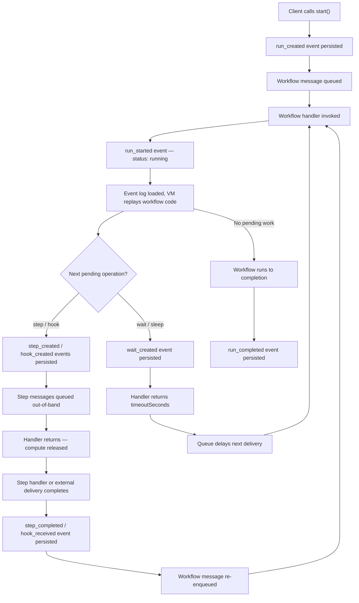

<Callout>
Traditional long-running background jobs keep a process alive for the entire duration of a workflow — even when the workflow is waiting for a step to finish, an external webhook, or a timer to expire. Workflow DevKit inverts this model: the orchestrator runs only when there is a decision to make, suspends by returning from the handler, and wakes up again via queue delivery when new data arrives. The compute cost is proportional to the work performed, not the wall-clock time of the workflow.
</Callout>

## Overview

The cost model is a direct consequence of three runtime mechanics:

1. **Queue-driven invocation** — workflow handlers are invoked by queue messages, not by long-lived processes. When there is no message, there is no compute.
2. **Zero-cost suspension for pending work** — when a workflow encounters a step or hook, the handler records the pending operation as an event, queues the out-of-band work, and exits. Nothing stays in memory between decision points.
3. **Delayed re-enqueue for timed waits** — when a workflow suspends on `sleep()`, the handler records a `wait_created` event, returns `timeoutSeconds`, and the queue delivers the next message after that delay.

Step completions and timed waits wake the workflow through different paths: steps resume the run by persisting `step_completed` and re-enqueueing the workflow, while waits resume the run by delayed queue delivery based on `timeoutSeconds`.

These three properties mean a workflow that sleeps for a week consumes compute only during the brief moments when it replays state and dispatches or collects results — not for the seven days in between.

## Lifecycle

The following diagram traces a single workflow run from creation through suspension, step execution, timed waits, and completion:



## Code Walkthrough

### Run creation and initial queue dispatch

When client code calls `start()`, two things happen in sequence: a `run_created` event is persisted to the event log, and a message is placed on the workflow queue. The function returns immediately with a `Run` handle — it does not wait for the workflow to execute.

```ts title="packages/core/src/runtime/start.ts" lineNumbers {29-30,33-39}
// Generate runId client-side so we have it before serialization
const runId = `wrun_${ulid()}`;

// ...

// Create run via run_created event (event-sourced architecture)
const result = await world.events.create(
  runId,
  {
    eventType: 'run_created',
    specVersion,
    eventData: {
      deploymentId: deploymentId,
      workflowName: workflowName,
      input: workflowArguments,
      executionContext: { traceCarrier, workflowCoreVersion },
    },
  },
  { v1Compat }
);

// ...

await world.queue(
  getWorkflowQueueName(workflowName),
  {
    runId,
    traceCarrier,
  } satisfies WorkflowInvokePayload,
  {
    deploymentId,
  }
);

return new Run<TResult>(runId);
```

The call to `world.queue()` is asynchronous but non-blocking from the caller's perspective — `start()` returns the `Run` object as soon as the message is accepted. The workflow handler that processes this message runs in a separate invocation, potentially on a different compute instance.

### Suspension: recording pending work and exiting

When the workflow VM encounters a step, hook, or sleep, it throws a `WorkflowSuspension` — a structured control-flow signal, not an error. The workflow handler in `runtime.ts` catches this, delegates to `handleSuspension`, and returns the result:

```ts title="packages/core/src/runtime.ts" lineNumbers
// WorkflowSuspension is normal control flow — not an error
if (WorkflowSuspension.is(err)) {
  const result = await handleSuspension({
    suspension: err,
    world,
    run: workflowRun,
    span,
    requestId,
  });

  if (result.timeoutSeconds !== undefined) {
    return { timeoutSeconds: result.timeoutSeconds };
  }

  // Suspension handled, no further work needed
  return;
}
```

Inside `handleSuspension`, each pending item is recorded as an event and dispatched:

- **Steps** get a `step_created` event and a queue message to the step handler
- **Hooks** get a `hook_created` event and wait for external data
- **Waits** get a `wait_created` event with a `resumeAt` timestamp

The handler then calculates the minimum timeout from any pending waits:

```ts title="packages/core/src/runtime/suspension-handler.ts" lineNumbers
// Calculate minimum timeout from waits
const now = Date.now();
const minTimeoutSeconds = waitItems.reduce<number | null>(
  (min, queueItem) => {
    const resumeAtMs = queueItem.resumeAt.getTime();
    const delayMs = Math.max(1000, resumeAtMs - now);
    const timeoutSeconds = Math.ceil(delayMs / 1000);
    if (min === null) return timeoutSeconds;
    return Math.min(min, timeoutSeconds);
  },
  null
);

// ...

if (minTimeoutSeconds !== null) {
  return { timeoutSeconds: minTimeoutSeconds };
}

return {};
```

Only waits contribute `timeoutSeconds` here. A step-driven suspension normally returns `{}` from `handleSuspension`; the later wake-up happens when the step handler persists `step_completed` and explicitly re-enqueues the workflow.

When `timeoutSeconds` is returned, the queue infrastructure uses it to schedule the next delivery. **The handler exits and the compute is freed.** No process sleeps or polls during the delay.

### Delayed re-enqueue in production (Vercel Queue Service)

On Vercel, the queue handler uses `delaySeconds` to schedule a new message rather than holding the current one:

```ts title="packages/world-vercel/src/queue.ts" lineNumbers
if (typeof result?.timeoutSeconds === 'number') {
  // When timeoutSeconds is 0, skip delaySeconds entirely for immediate re-enqueue.
  // Otherwise, clamp to max delay (23h) - for longer sleeps, the workflow will chain
  // multiple delayed messages until the full sleep duration has elapsed.
  const delaySeconds =
    result.timeoutSeconds > 0
      ? Math.min(result.timeoutSeconds, MAX_DELAY_SECONDS)
      : undefined;

  // Send new message BEFORE acknowledging current message.
  // This ensures crash safety: if process dies after send but before ack,
  // we may get a duplicate invocation but won't lose the scheduled wakeup.
  await queue(queueName, payload, { deploymentId, delaySeconds });
}
```

For sleeps longer than 23 hours (the maximum single-message delay), the system chains messages automatically. Each time the delayed message fires, the workflow handler checks whether `now >= resumeAt`. If the sleep has not elapsed, it returns another `timeoutSeconds` and the cycle repeats.

### Delayed re-enqueue in local development

The local queue implements the same contract using `setTimeout`:

```ts title="packages/world-local/src/queue.ts" lineNumbers
if (response.ok) {
  try {
    const timeoutSeconds = Number(JSON.parse(text).timeoutSeconds);
    if (Number.isFinite(timeoutSeconds) && timeoutSeconds >= 0) {
      if (timeoutSeconds > 0) {
        const timeoutMs = Math.min(
          timeoutSeconds * 1000,
          MAX_SAFE_TIMEOUT_MS
        );
        await setTimeout(timeoutMs);
      }
      continue;
    }
  } catch {}
  return;
}
```

The local queue keeps the message in-process and uses a `setTimeout` to delay the next loop iteration. This simulates the production behavior where the message is invisible for the delay period.

### Step completion triggers workflow re-invocation

When a step finishes — whether successfully or with a terminal failure — the step handler re-enqueues the workflow so it can replay with the new result:

```ts title="packages/core/src/runtime/step-handler.ts" lineNumbers
// Queue the workflow continuation with the concurrently-resolved trace carrier
await queueMessage(world, getWorkflowQueueName(workflowName), {
  runId: workflowRunId,
  traceCarrier,
  requestedAt: new Date(),
});
```

This is the mechanism that drives the workflow forward without a persistent orchestrator process. Each step completion is a discrete event that triggers exactly one workflow re-invocation.

### Run completion

When the workflow VM runs to the end of the function without throwing a `WorkflowSuspension`, the handler persists a `run_completed` event and returns without re-enqueueing:

```ts title="packages/core/src/runtime.ts" lineNumbers
await world.events.create(
  runId,
  {
    eventType: 'run_completed',
    specVersion: SPEC_VERSION_CURRENT,
    eventData: {
      output: workflowResult,
    },
  },
  { requestId }
);
```

No further messages are queued. The workflow is done, and no compute resources remain allocated.

## Why This Matters

The queue-driven execution model means workflow compute is consumed only during active processing:

- **No always-on worker loop** — workflow handlers are invoked on demand by queue messages. Between invocations, no process exists. This is fundamentally different from traditional job runners that poll a database or maintain long-lived connections.
- **Wall-clock time is free** — a `sleep('7d')` call costs the same as a `sleep('5s')` call in terms of compute. Both produce a delayed queue message and release all resources immediately.
- **Replay is cheap** — re-executing the workflow VM to reconstruct state takes milliseconds for typical workflows. Step results are cached in the event log, so replayed steps return instantly without re-executing their bodies.
- **Parallel steps share nothing** — `Promise.all([stepA(), stepB()])` dispatches both steps as independent queue messages. Each step runs in its own invocation with full Node.js access, and both can execute concurrently on separate compute instances.
- **Crash safety without cost** — if a handler crashes mid-execution, the queue automatically re-delivers the message. The event log ensures that any work already persisted is not repeated. Recovery is a normal re-invocation, not a special monitoring process.

<Callout type="info">
The cost characteristics described here are a consequence of the queue and suspension mechanics, not a separately configurable feature. Any deployment target that provides queue-based message delivery with delay support (such as Vercel Queue Service in production, or the local filesystem queue in development) inherits these properties automatically.
</Callout>
