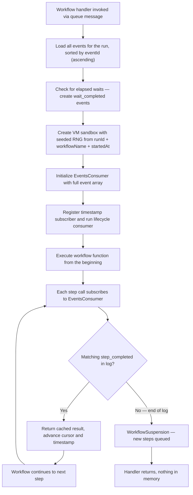
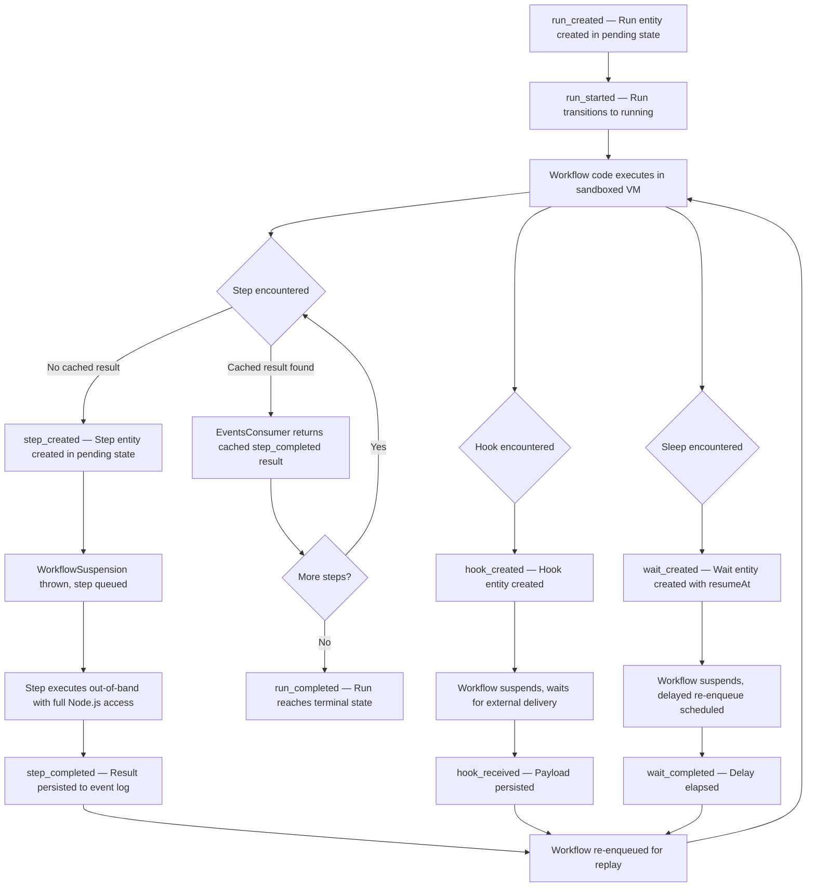

Your workflow charged a credit card, reserved inventory, and sent a confirmation email. Then the process died. What happens next?

In a traditional system, the answer is complicated. You'd need to figure out what already happened — maybe by querying a database, checking an external service, or reading from a checkpoint file. If your checkpoint was stale or your serialization format changed between deploys, you'd be debugging state reconstruction bugs at 2 AM.

Workflow DevKit takes a fundamentally different approach. There's no checkpoint. There's no serialized heap snapshot. Instead, there's an append-only **Event log** — and a runtime that can reconstruct any workflow's state by replaying that log from the beginning.

This article explains exactly how that works: the **Event log** structure, the ordering guarantees, the replay engine, and why this model eliminates entire categories of durability bugs.

## The Event Log Is the State

Most workflow systems store state as a mutable object — a row in a database, a JSON blob, a serialized heap. When something changes, the state object is updated in place. This works until it doesn't: concurrent updates conflict, partial writes corrupt state, and version mismatches between the serialization format and the running code produce silent bugs.

Workflow DevKit stores no mutable state. Instead, every transition — a run starting, a step completing, a webhook arriving, a sleep elapsing — is recorded as an immutable, typed event appended to a log. The current state of any entity is derived by reading its events in order.

The event types are defined in `packages/world/src/events.ts` as a Zod discriminated union:

```ts
// From packages/world/src/events.ts
export const EventTypeSchema = z.enum([
  // Run lifecycle events
  'run_created',
  'run_started',
  'run_completed',
  'run_failed',
  'run_cancelled',
  // Step lifecycle events
  'step_created',
  'step_completed',
  'step_failed',
  'step_retrying',
  'step_started',
  // Hook lifecycle events
  'hook_created',
  'hook_received',
  'hook_disposed',
  'hook_conflict',
  // Wait lifecycle events
  'wait_created',
  'wait_completed',
]);
```

Every event shares a common structure — an `eventType`, an optional `correlationId` that links events for the same entity, and typed `eventData` specific to that event:

```ts
// From packages/world/src/events.ts
export const BaseEventSchema = z.object({
  eventType: EventTypeSchema,
  correlationId: z.string().optional(),
  specVersion: z.number().optional(),
});

// Server response adds run-level and temporal fields
export const EventSchema = AllEventsSchema.and(
  z.object({
    runId: z.string(),
    eventId: z.string(),
    createdAt: z.coerce.date(),
    specVersion: z.number().optional(),
  })
);
```

Four entity categories — runs, steps, hooks, and waits — each follow a defined state machine:

| Entity | Events | Terminal States |
|--------|--------|-----------------|
| Run | `run_created` → `run_started` → `run_completed` / `run_failed` / `run_cancelled` | completed, failed, cancelled |
| Step | `step_created` → `step_started` → `step_completed` / `step_failed` (with optional `step_retrying` loops) | completed, failed |
| Hook | `hook_created` → `hook_received`* → `hook_disposed` (or `hook_conflict` on token collision) | disposed, conflicted |
| Wait | `wait_created` → `wait_completed` | completed |

<Callout type="info">
Terminal states are enforced at the world backend layer. Attempting to create an event that would transition an entity out of a terminal state — for example, a second `step_completed` on an already-completed step — results in an `EntityConflictError`. This is the mechanism that guarantees exactly-once step execution, even when duplicate messages arrive from the queue.
</Callout>

## ULID Ordering: Time in the ID

Events need to be ordered. Most event-sourced systems use a separate sequence number — an auto-incrementing integer managed by the database. Workflow DevKit embeds the ordering directly in the event ID using ULIDs (Universally Unique Lexicographically Sortable Identifiers).

A ULID encodes a millisecond timestamp in its first 48 bits, followed by 80 bits of randomness. Sorting ULIDs lexicographically produces chronological order without any additional column or index. This means the event log is self-ordering — you can sort by `eventId` and get the correct temporal sequence.

But embedding timestamps in client-generated IDs creates a trust problem. What if a client sends an event with a forged timestamp that sorts before legitimate events? The `validateUlidTimestamp` function in `packages/world/src/ulid.ts` prevents this:

```ts
// From packages/world/src/ulid.ts
export const DEFAULT_TIMESTAMP_THRESHOLD_MS = 5 * 60 * 1000;

export function validateUlidTimestamp(
  prefixedUlid: string,
  prefix: string,
  thresholdMs: number = DEFAULT_TIMESTAMP_THRESHOLD_MS
): string | null {
  const raw = prefixedUlid.startsWith(prefix)
    ? prefixedUlid.slice(prefix.length)
    : prefixedUlid;

  const ulidTimestamp = ulidToDate(raw);
  if (!ulidTimestamp) {
    return `Invalid runId: "${prefixedUlid}" is not a valid ULID`;
  }

  const serverTimestamp = new Date();
  const driftMs = Math.abs(
    serverTimestamp.getTime() - ulidTimestamp.getTime()
  );

  if (driftMs <= thresholdMs) {
    return null;
  }

  const driftSeconds = Math.round(driftMs / 1000);
  const thresholdSeconds = Math.round(thresholdMs / 1000);
  return `Invalid runId timestamp: embedded timestamp differs from server time by ${driftSeconds}s (threshold: ${thresholdSeconds}s)`;
}
```

Any client-generated ULID whose embedded timestamp drifts more than 5 minutes from server time is rejected. This prevents clock-skew attacks where manipulated IDs could sort before or after legitimate events, corrupting the log's chronological integrity.

Inside the workflow VM, ULIDs use the seeded RNG for their random component, so IDs generated during replay match those from the original execution:

```ts
// From packages/core/src/workflow.ts
const ulid = monotonicFactory(() => vmGlobalThis.Math.random());
```

## The Replay Engine: EventsConsumer

When a workflow needs to resume — after a cold start, a step completion, or a sleep elapsing — the runtime doesn't try to deserialize a snapshot. It loads the **Event log** and replays the **Workflow bundle** from the beginning. The `EventsConsumer` class in `packages/core/src/events-consumer.ts` is the mechanism that makes this work. Workflow state is reconstructed by replaying code against the **Event log**, not by resuming in-memory state.

The consumer holds the full event array and a cursor (`eventIndex`) that starts at zero and advances as events are matched to callbacks:

```ts
// From packages/core/src/events-consumer.ts
export class EventsConsumer {
  eventIndex: number;
  readonly events: Event[] = [];
  readonly callbacks: EventConsumerCallback[] = [];

  private consume = () => {
    const currentEvent = this.events[this.eventIndex] ?? null;
    for (let i = 0; i < this.callbacks.length; i++) {
      const callback = this.callbacks[i];
      let handled = EventConsumerResult.NotConsumed;
      try {
        handled = callback(currentEvent);
      } catch (error) {
        eventsLogger.error('EventConsumer callback threw an error', { error });
      }
      if (
        handled === EventConsumerResult.Consumed ||
        handled === EventConsumerResult.Finished
      ) {
        this.eventIndex++;
        if (handled === EventConsumerResult.Finished) {
          this.callbacks.splice(i, 1);
        }
        process.nextTick(this.consume);
        return;
      }
    }
  };
}
```

Each callback returns one of three results:

- **`Consumed`** — the callback handled this event but wants to stay registered for future events (used for multi-event entity lifecycles)
- **`NotConsumed`** — the callback doesn't match this event; pass it to the next callback
- **`Finished`** — the callback handled this event and is done; remove it from the list

When a callback consumes an event, the cursor advances by one, and the next `consume()` call is scheduled via `process.nextTick`. This microtask-based scheduling ensures events are processed one at a time in order, while yielding to other async work between events.

### How Callbacks Map to Workflow Primitives

When the runtime sets up a replay, it registers several categories of callbacks:

1. **Timestamp subscriber** — a passive callback that never consumes events but updates the VM's `fixedTimestamp` from each event's `createdAt`. This makes `Date.now()` inside the workflow advance through the original execution timeline during replay.

2. **Run lifecycle consumer** — consumes `run_created` and `run_started` events to advance past the structural events that precede workflow code execution.

3. **Step/hook/wait consumers** — registered dynamically as the workflow code re-executes. When the replaying workflow calls `await myStep(input)`, the `useStep` proxy subscribes a callback that looks for the matching `step_completed` event. If found, the cached result is returned. If the cursor reaches end-of-log (`null`), the step hasn't completed yet and the workflow suspends.

```ts
// From packages/core/src/workflow.ts — timestamp advancement
workflowContext.eventsConsumer.subscribe((event) => {
  const createdAt = event?.createdAt;
  if (createdAt) {
    updateTimestamp(+createdAt);
  }
  // Never consume events - this is only a passive subscriber
  return EventConsumerResult.NotConsumed;
});

// Run lifecycle events must be consumed to advance past them
workflowContext.eventsConsumer.subscribe((event) => {
  if (!event) {
    return EventConsumerResult.NotConsumed;
  }
  if (event.eventType === 'run_created') {
    return EventConsumerResult.Consumed;
  }
  if (event.eventType === 'run_started') {
    return EventConsumerResult.Consumed;
  }
  return EventConsumerResult.NotConsumed;
});
```

### Orphan Event Protection

What happens if an event in the log doesn't match any registered callback? This indicates either a corrupted log or a code change that removed a step the log still contains events for. The `EventsConsumer` handles this with a deferred orphan check:

```ts
// From packages/core/src/events-consumer.ts
if (currentEvent !== null) {
  const checkVersion = ++this.unconsumedCheckVersion;
  this.pendingUnconsumedCheck = this.getPromiseQueue().then(() => {
    this.pendingUnconsumedTimeout = setTimeout(() => {
      if (this.unconsumedCheckVersion === checkVersion) {
        this.onUnconsumedEvent(currentEvent);
      }
    }, 100);
  });
}
```

The check is deliberately deferred in two stages. First, it chains onto the promise queue — this ensures that any pending async deserialization (which might trigger downstream `subscribe()` calls) has time to complete. Then it waits 100ms via `setTimeout`, giving cross-VM-boundary microtasks time to settle. If a new `subscribe()` call arrives during this window, it increments `unconsumedCheckVersion`, which cancels the check. Only a truly orphaned event — one that no callback claims after all async work is done — triggers the `onUnconsumedEvent` handler, which flags the log as corrupted.

## The Cold Start Sequence

Here's the complete reconstruction sequence when a workflow resumes. This happens after a cold start, a step completion, a webhook delivery, or a sleep elapsing:



The key code in `packages/core/src/runtime.ts` loads and pre-processes events before handing them to the workflow:

```ts
// From packages/core/src/runtime.ts
// Load all events into memory before running
const events = await getAllWorkflowRunEvents(workflowRun.runId);

// Check for any elapsed waits and create wait_completed events
const now = Date.now();

const completedWaitIds = new Set(
  events
    .filter((e) => e.eventType === 'wait_completed')
    .map((e) => e.correlationId)
);

const waitsToComplete = events
  .filter(
    (e) =>
      e.eventType === 'wait_created' &&
      e.correlationId !== undefined &&
      !completedWaitIds.has(e.correlationId) &&
      now >= (e.eventData.resumeAt).getTime()
  )
  .map((e) => ({
    eventType: 'wait_completed' as const,
    specVersion: SPEC_VERSION_CURRENT,
    correlationId: e.correlationId,
  }));
```

Then the VM context is created with the same deterministic seed:

```ts
// From packages/core/src/workflow.ts
const {
  context,
  globalThis: vmGlobalThis,
  updateTimestamp,
} = createContext({
  seed: `${workflowRun.runId}:${workflowRun.workflowName}:${+startedAt}`,
  fixedTimestamp: +startedAt,
});
```

Same run ID, same workflow name, same start timestamp — same seed. Same seed — same `Math.random()` sequence, same initial `Date.now()`. The **Workflow bundle** re-executes identically, and every step call returns its cached result from the **Event log**. Step input is hydrated from the persisted `step_created` event, not from the **Queue message**.

The `getAllWorkflowRunEvents` function in `packages/core/src/runtime/helpers.ts` paginates through all events, always in ascending sort order:

```ts
// From packages/core/src/runtime/helpers.ts
const response = await world.events.list({
  runId,
  pagination: {
    sortOrder: 'asc', // Required: events must be in chronological order for replay
    cursor: cursor ?? undefined,
  },
});
```

## Why Not Snapshots?

The event-sourced replay model is counterintuitive at first. Why replay from the beginning when you could just checkpoint the current state? The answer is that snapshot-based approaches introduce three problems that event sourcing eliminates:

**1. No serialization format to version.** Snapshot systems must serialize the workflow's in-flight state — local variables, call stack, pending promises — into a storable format. When you deploy new code that changes a variable name, adds a field, or restructures a function, existing snapshots become invalid. You need migration logic, versioned serialization, or both.

With event sourcing, the log contains step results, not heap state. New code replays against the same events and reconstructs the same derived state. There's no snapshot format to migrate.

**2. Complete auditability.** Every state transition is an immutable event with a timestamp, correlation ID, and typed payload. Debugging a failed workflow means reading a flat list of events — not reconstructing an opaque binary snapshot. You can see exactly what happened, in what order, and what each step returned.

**3. Exactly-once step execution.** Terminal state enforcement at the world layer guarantees that concurrent step completions resolve to a single winner. If two queue workers try to complete the same step simultaneously, one succeeds and one receives an `EntityConflictError`. The event log never contains duplicate completions.

Snapshot systems don't get this for free. They need external locking, distributed consensus, or idempotency keys bolted on after the fact.

## Replay Performance

A natural concern with replay-from-the-beginning is performance. If a workflow has 200 completed steps, does replay take 200× longer than a single step?

No. Replay re-executes only the orchestration logic — the `"use workflow"` function — which is lightweight branching and `await` calls. Each step call hits the `EventsConsumer`, finds the cached `step_completed` result, deserializes it, and returns. No network calls, no database queries, no external service interactions.

The workflow handler is invoked once per new step completion. A workflow with 200 steps invokes the handler roughly 200 times over its lifetime. But each invocation replays all previously completed steps from cache in milliseconds — the time is dominated by deserialization, not computation. The total replay cost is proportional to the number of events times the deserialization cost per event, which is typically sub-millisecond for each.

## The Lifecycle in Full

Putting it all together, here's the complete lifecycle of a workflow run from creation to completion:



Every arrow in this diagram corresponds to an immutable event in the log. The workflow's state at any point in time is the projection of all events up to that point. There's no separate state store, no mutable row, no snapshot — the event log is the single source of truth.

## What This Enables

The durability model is the foundation that makes the rest of the Workflow DevKit architecture possible:

- **Cost efficiency** — Between steps, nothing is in memory. The **Event log** is the complete state. A **Queue message** is a trigger, not durable state. A workflow waiting 3 days for a webhook costs zero compute during those 3 days.
- **Durable streaming** — Stream state is persisted alongside the **Event log**, surviving restarts and replays.
- **Deployment safety** — New code deploys don't invalidate in-flight workflows. The **Event log** doesn't change; the new **Workflow bundle** replays against the same events.
- **Debuggability** — A failed workflow's **Event log** is a complete, ordered record of everything that happened. No guesswork.

The **Event log** is the state. Everything else is derived.
