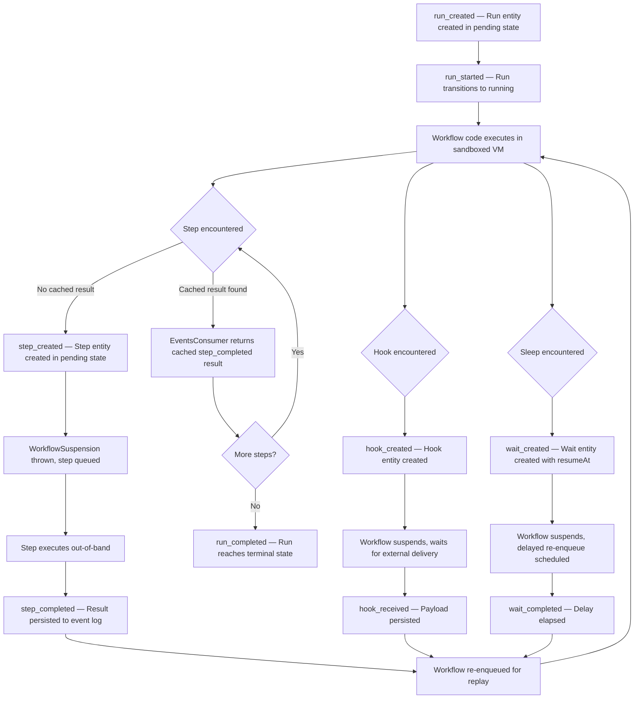

<Callout>
Durability in the Workflow DevKit means that no workflow progress is ever lost. Every step result, hook delivery, and sleep completion is persisted as an immutable event. When a workflow resumes — after a cold start, a deploy, or a scale-from-zero event — the runtime reads the event log, recreates the VM context, and replays the workflow code. Cached results are returned instantly from the log, so the workflow arrives at exactly the same point it left off without re-executing any side effects.
</Callout>

## Overview

The Workflow DevKit's durability model is built on three pillars:

1. **Event sourcing** — All state mutations are stored as an append-only sequence of typed events. Entity state (runs, steps, hooks, waits) is derived from events, never stored independently of them.
2. **ULID-based ordering** — Event IDs use ULIDs (Universally Unique Lexicographically Sortable Identifiers), embedding a millisecond timestamp in the first 48 bits. Sorting by event ID produces chronological order without a separate sequence number.
3. **Deterministic replay** — The `EventsConsumer` feeds persisted events to registered callbacks in order. Each callback either consumes the event (advancing the cursor) or passes it to the next callback. The workflow VM re-executes orchestration code, but every step call returns its cached result from the log instead of re-executing.

## Lifecycle



## Code Walkthrough

### Event types and entity lifecycles

The event log is a flat, append-only sequence of typed events defined in `packages/world/src/events.ts`. Each event belongs to one of four entity categories — run, step, hook, or wait — and transitions the entity through a defined state machine:

| Entity | Events | Terminal States |
|--------|--------|-----------------|
| Run | `run_created` → `run_started` → `run_completed` / `run_failed` / `run_cancelled` | completed, failed, cancelled |
| Step | `step_created` → `step_started` → `step_completed` / `step_failed` (with optional `step_retrying` loops) | completed, failed |
| Hook | `hook_created` → `hook_received`* → `hook_disposed` (or `hook_conflict` on token collision) | disposed, conflicted |
| Wait | `wait_created` → `wait_completed` | completed |

Events within a run share the `runId`. Events within a step, hook, or wait share a `correlationId` — a prefixed ULID that links all events for that entity:

```ts title="packages/world/src/events.ts (base schema)" lineNumbers
export const BaseEventSchema = z.object({
  eventType: EventTypeSchema,
  correlationId: z.string().optional(),
  specVersion: z.number().optional(),
});

// Server response adds run-level and temporal fields
export const EventSchema = AllEventsSchema.and(
  z.object({
    runId: z.string(),
    eventId: z.string(),
    createdAt: z.coerce.date(),
    specVersion: z.number().optional(),
  })
);
```

<Callout type="info">
Terminal states are enforced by the world backend. Attempting to create an event that would transition an entity out of a terminal state (e.g., `step_completed` on an already-completed step) results in an `EntityConflictError`. This guarantees that every step completes exactly once, even under concurrent execution.
</Callout>

### EventsConsumer: replay engine

The `EventsConsumer` class in `packages/core/src/events-consumer.ts` is the core replay mechanism. It holds the full event array for a run and a cursor (`eventIndex`) that advances as events are consumed by registered callbacks:

```ts title="packages/core/src/events-consumer.ts" lineNumbers
export class EventsConsumer {
  eventIndex: number;
  readonly events: Event[] = [];
  readonly callbacks: EventConsumerCallback[] = [];

  private consume = () => {
    const currentEvent = this.events[this.eventIndex] ?? null;
    for (let i = 0; i < this.callbacks.length; i++) {
      const callback = this.callbacks[i];
      let handled = EventConsumerResult.NotConsumed;
      try {
        handled = callback(currentEvent);
      } catch (error) {
        eventsLogger.error('EventConsumer callback threw an error', { error });
      }
      if (
        handled === EventConsumerResult.Consumed ||
        handled === EventConsumerResult.Finished
      ) {
        this.eventIndex++;
        if (handled === EventConsumerResult.Finished) {
          this.callbacks.splice(i, 1);
        }
        process.nextTick(this.consume);
        return;
      }
    }

    // If no callback consumed a real event, schedule orphan detection
    if (currentEvent !== null) {
      const checkVersion = ++this.unconsumedCheckVersion;
      this.pendingUnconsumedCheck = this.getPromiseQueue().then(() => {
        this.pendingUnconsumedTimeout = setTimeout(() => {
          if (this.unconsumedCheckVersion === checkVersion) {
            this.onUnconsumedEvent(currentEvent);
          }
        }, 100);
      });
    }
  };
}
```

**How replay works step by step:**

1. The runtime loads the event array for the run from the world backend.
2. `EventsConsumer` is initialized with the full array and `eventIndex = 0`.
3. Callbacks are registered via `subscribe()` — one passive subscriber for timestamp advancement, one for run lifecycle events (`run_created`, `run_started`), and one per step/hook/wait as the workflow code re-executes.
4. Each call to `consume()` tries the current event against all callbacks. The first callback that returns `Consumed` or `Finished` advances the cursor and schedules the next `consume()` via `process.nextTick`.
5. When the cursor reaches past all persisted events, step callbacks receive `null` (end of log). A step callback seeing `null` knows the step hasn't executed yet and triggers suspension.

**Orphan event protection:** If a non-null event passes through all callbacks without being consumed, the consumer defers an orphan check. It chains onto the promise queue (to let pending async deserialization complete) and then waits 100 ms. If no new `subscribe()` call cancels the check by incrementing `unconsumedCheckVersion`, the event is flagged as orphaned — indicating a corrupted or invalid event log.

### ULID ordering and timestamp validation

All entity IDs in the Workflow DevKit are prefixed ULIDs (e.g., `wrun_01HXYZ...`, `step_01HXYZ...`, `evnt_01HXYZ...`). The `packages/world/src/ulid.ts` module provides utilities for extracting and validating the embedded timestamps:

```ts title="packages/world/src/ulid.ts" lineNumbers
export const DEFAULT_TIMESTAMP_THRESHOLD_MS = 5 * 60 * 1000;

export function validateUlidTimestamp(
  prefixedUlid: string,
  prefix: string,
  thresholdMs: number = DEFAULT_TIMESTAMP_THRESHOLD_MS
): string | null {
  const raw = prefixedUlid.startsWith(prefix)
    ? prefixedUlid.slice(prefix.length)
    : prefixedUlid;

  const ulidTimestamp = ulidToDate(raw);
  if (!ulidTimestamp) {
    return `Invalid runId: "${prefixedUlid}" is not a valid ULID`;
  }

  const serverTimestamp = new Date();
  const driftMs = Math.abs(
    serverTimestamp.getTime() - ulidTimestamp.getTime()
  );

  if (driftMs <= thresholdMs) {
    return null;
  }

  const driftSeconds = Math.round(driftMs / 1000);
  const thresholdSeconds = Math.round(thresholdMs / 1000);
  return `Invalid runId timestamp: embedded timestamp differs from server time by ${driftSeconds}s (threshold: ${thresholdSeconds}s)`;
}
```

ULIDs provide two guarantees that the event log depends on:

- **Chronological sortability** — Sorting events by their ULID-based `eventId` produces the correct temporal order. No separate sequence column is needed.
- **Timestamp validation** — `validateUlidTimestamp` rejects client-generated IDs whose embedded timestamp drifts more than 5 minutes from server time. This prevents clock-skew attacks where a malicious client could forge IDs that sort before or after legitimate events.

Inside the workflow VM, ULIDs are generated using the seeded RNG for the random component, ensuring that IDs created during replay match those created during the original execution:

```ts title="packages/core/src/workflow.ts (ULID generation)" lineNumbers
const ulid = monotonicFactory(() => vmGlobalThis.Math.random());
```

### Deterministic reconstruction after cold starts

When a workflow is re-invoked (after suspension, a deploy, or a cold start), the reconstruction sequence is:

1. **Event log loaded** — The world backend returns all events for the run, ordered by event ID.
2. **VM context created** — `createContext()` builds a fresh sandbox with the same seed (derived from run ID, workflow name, and start timestamp). This produces the same seeded RNG and the same initial `fixedTimestamp`.
3. **Timestamp subscriber registered** — A passive `EventsConsumer` callback updates the VM's `fixedTimestamp` from each event's `createdAt`. As events are consumed during replay, `Date.now()` inside the workflow advances to match the original execution timeline.
4. **Workflow code re-executed** — The workflow function runs from the beginning. Each step call hits the `WORKFLOW_USE_STEP` proxy, which consults the `EventsConsumer`. For completed steps, the consumer returns the cached `step_completed` result instantly. For steps not yet in the log, the workflow suspends.
5. **Promise queue drained** — Async operations (deserialization, decryption of step results) are chained onto a shared promise queue. The `EventsConsumer` waits for the queue to drain before checking for orphan events, preventing false positives from async gaps.

The result: the workflow arrives at exactly the point where it last suspended, with all local variables holding the same values, all branching decisions following the same paths, and `Date.now()` reflecting the time of the most recent event — not wall-clock time.

## Why This Matters

The event-sourced replay model eliminates three classes of problems that plague durable workflow systems:

1. **No state serialization format** — The workflow doesn't checkpoint its JavaScript heap. Instead, the event log contains step results, and the deterministic VM reconstructs everything else. This means there's no versioning problem when workflow code changes between deploys — new code replays against the same events.

2. **Complete auditability** — Every state transition is an immutable event with a timestamp, correlation ID, and typed payload. Debugging a failed workflow means reading a flat list of events, not reconstructing opaque snapshots.

3. **Exactly-once step execution** — Terminal state enforcement at the world layer guarantees that concurrent step completions resolve to a single winner. The `EntityConflictError` mechanism means a step can never complete twice, even if duplicate messages arrive from the queue.
