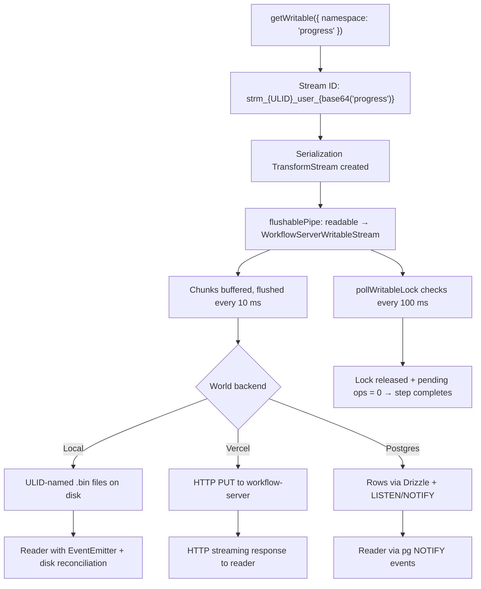

You're building an AI-powered feature. Your step function calls an LLM, and tokens stream back one at a time. The user sees them appear in the UI as they arrive. Then the serverless function hits its timeout, or the instance scales down, or a deploy rolls through.

What happens to those tokens?

In most frameworks: they're gone. The in-memory stream buffer evaporates with the process. The UI shows a spinner forever, or an error, or — worst case — partial results with no indication that they're incomplete.

Workflow DevKit's durable streaming solves this. Every chunk is persisted to a world backend as it arrives. Readers can reconnect from any index. And the stream outlives the function that created it.

This article walks through the full streaming pipeline — from the `getWritable()` call in your code, through serialization, buffered flushes, and lock-aware completion, to the persistence backends that store chunks for local development and production.

## Two Sides of getWritable()

The same `getWritable()` function call does fundamentally different things depending on where it's called.

### The Workflow Side: A Serializable Handle

Inside a `"use workflow"` function, `getWritable()` returns a lightweight handle — not a real writable stream. It's an object that carries a `STREAM_NAME_SYMBOL` property with the stream's deterministic ID, but sets up no I/O pipeline:

```ts
// From packages/core/src/workflow/writable-stream.ts
export function getWritable<W = any>(
  options: WorkflowWritableStreamOptions = {}
): WritableStream<W> {
  const { namespace } = options;
  const name = (globalThis as any)[WORKFLOW_GET_STREAM_ID](namespace);
  return Object.create(globalThis.WritableStream.prototype, {
    [STREAM_NAME_SYMBOL]: {
      value: name,
      writable: false,
    },
  });
}
```

This handle looks like a `WritableStream` to TypeScript, but it's really a token. The framework's serialization layer recognizes the `STREAM_NAME_SYMBOL` and reconstitutes a real writable when the object crosses the workflow → step boundary.

Why not set up real I/O in the workflow? Because workflow functions run in a sandboxed VM without network access. They orchestrate — they don't do I/O. The handle is a promise of a stream, not the stream itself.

<Callout type="info">
Real stream I/O cannot happen inside workflow functions. The `getWritable()` call in a `"use workflow"` context returns a serializable handle, not a functioning stream. The full I/O pipeline — serialization, buffered flushes, world-backend persistence — is set up only when the handle reaches a step function. This restriction exists because workflow code must be deterministic and replayable; streaming is a side effect that belongs in step functions.
</Callout>

### The Step Side: The Full Pipeline

Inside a `"use step"` function (or any step-level runtime context), `getWritable()` sets up the complete I/O pipeline:

```ts
// From packages/core/src/step/writable-stream.ts
export function getWritable<W = any>(
  options: WorkflowWritableStreamOptions = {}
): WritableStream<W> {
  const ctx = contextStorage.getStore();
  if (!ctx) {
    throw new Error(
      '`getWritable()` can only be called inside a workflow or step function'
    );
  }

  const { namespace } = options;
  const runId = ctx.workflowMetadata.workflowRunId;
  const name = getWorkflowRunStreamId(runId, namespace);

  const serialize = getSerializeStream(
    getExternalReducers(globalThis, ctx.ops, runId, ctx.encryptionKey),
    ctx.encryptionKey
  );

  const serverWritable = new WorkflowServerWritableStream(name, runId);
  const state = createFlushableState();
  ctx.ops.push(state.promise);

  flushablePipe(serialize.readable, serverWritable, state).catch(() => {});
  pollWritableLock(serialize.writable, state);

  return serialize.writable;
}
```

Five things happen in sequence:

1. **Stream ID generated** — `getWorkflowRunStreamId` builds a deterministic ID from the run ID and optional namespace
2. **Serialization transform created** — a `TransformStream` that handles serialization (and optional encryption) of chunks
3. **Server writable created** — `WorkflowServerWritableStream` is the bridge to the world backend
4. **Flush pipe connected** — `flushablePipe` reads from the transform and writes to the server writable
5. **Lock polling started** — `pollWritableLock` watches for the user to release their writer lock

The `state.promise` is pushed onto `ctx.ops`, which ties stream completion to step completion. The step can't finish until the stream is done.

## Namespaced Stream IDs

Every stream needs a unique, deterministic identifier. `getWorkflowRunStreamId` in `packages/core/src/util.ts` builds it:

```ts
// From packages/core/src/util.ts
export function getWorkflowRunStreamId(runId: string, namespace?: string) {
  const streamId = `${runId.replace('wrun_', 'strm_')}_user`;
  if (!namespace) {
    return streamId;
  }
  const encodedNamespace = Buffer.from(namespace, 'utf-8').toString(
    'base64url'
  );
  return `${streamId}_${encodedNamespace}`;
}
```

The format is `strm_{ULID}_user_{base64url(namespace)?}`. When you call `getWritable({ namespace: 'progress' })`, the namespace is base64url-encoded and appended. This lets a single workflow run own multiple independent streams — one for LLM tokens, one for progress events, one for structured logs — without collision.

The `_user` segment distinguishes user-created streams from any internal framework streams. It's a namespace for namespaces.

On the reader side, the same namespace flows through `run.getReadable({ namespace })` — which calls `getWorkflowRunStreamId` with the run ID and namespace to reconstruct the same deterministic stream ID. Readers and writers agree on the stream identity without any external coordination.

## Buffered Writes: The 10 ms Window

Individual chunk writes to an HTTP backend would be catastrophically slow. If you're streaming LLM tokens, you might get 50-100 chunks per second. One HTTP request per chunk would saturate connections and add seconds of latency.

`WorkflowServerWritableStream` solves this with a buffered write strategy:

```ts
// From packages/core/src/serialization.ts (simplified)
const STREAM_FLUSH_INTERVAL_MS = 10;

let buffer: Uint8Array[] = [];

const flush = async (): Promise<void> => {
  if (buffer.length === 0) return;
  const chunksToFlush = buffer.slice();

  if (typeof world.writeToStreamMulti === 'function' && chunksToFlush.length > 1) {
    await world.writeToStreamMulti(name, runId, chunksToFlush);
  } else {
    for (const chunk of chunksToFlush) {
      await world.writeToStream(name, runId, chunk);
    }
  }
  buffer = [];
};
```

Chunks accumulate in a buffer. Every 10 milliseconds, a flush timer fires and sends the entire batch in a single `writeToStreamMulti` call. Each `write()` caller awaits the flush result, so backpressure propagates naturally — if the backend is slow, the buffer grows but callers block.

The result: 100 chunks/second becomes roughly 10 batched network calls/second. The backend handles far less traffic, and the writer barely notices the batching.

## The Lock Polling Problem

Here's a subtle problem with the Web Streams API. When you get a writer from a `WritableStream`, the stream is "locked" — other code can't write to it. When you release the writer (by calling `releaseLock()`), the stream becomes unlocked. But there's no event for "the lock was released."

This matters because a step function might look like this:

```ts
export async function generateResponse(prompt: string) {
  "use step";
  const stream = getWritable({ namespace: 'ai-tokens' });
  const writer = stream.getWriter();
  for await (const token of llm.stream(prompt)) {
    await writer.write(token);
  }
  writer.releaseLock();
  return { status: 'done' };
}
```

The developer releases the lock and returns. But how does the framework know the stream is "done"? The stream itself isn't closed — `releaseLock()` doesn't close it. And `.pipeTo()` only resolves when the stream closes, so using that would hang the serverless function until timeout.

`flushable-stream.ts` solves this with a 100 ms polling loop:

```ts
// From packages/core/src/flushable-stream.ts (simplified)
export const LOCK_POLL_INTERVAL_MS = 100;

export function pollWritableLock(
  writable: WritableStream,
  state: FlushableStreamState
): void {
  const intervalId = setInterval(() => {
    if (state.doneResolved || state.streamEnded) {
      clearInterval(intervalId);
      return;
    }
    if (isWritableUnlockedNotClosed(writable) && state.pendingOps === 0) {
      state.doneResolved = true;
      state.resolve();
      clearInterval(intervalId);
    }
  }, LOCK_POLL_INTERVAL_MS);
}
```

Every 100 ms, the poller checks: is the writable unlocked? Are there zero pending flush operations? If both conditions are true, the state promise resolves and the step can complete. The framework handles the stream lifecycle so the developer doesn't have to call `.close()` explicitly.

## The Pump: flushablePipe

`flushablePipe` is the read-write loop that connects the serialization transform to the server writable. It tracks `pendingOps` to coordinate with the lock poller:

```ts
// From packages/core/src/flushable-stream.ts (excerpt)
export async function flushablePipe(
  source: ReadableStream,
  sink: WritableStream,
  state: FlushableStreamState
): Promise<void> {
  const reader = source.getReader();
  const writer = sink.getWriter();

  try {
    while (true) {
      const readResult = await reader.read();
      if (readResult.done) {
        state.streamEnded = true;
        await writer.close();
        if (!state.doneResolved) {
          state.doneResolved = true;
          state.resolve();
        }
        return;
      }
      state.pendingOps++;
      try {
        await writer.write(readResult.value);
      } finally {
        state.pendingOps--;
      }
    }
  } catch (err) {
    state.streamEnded = true;
    if (!state.doneResolved) {
      state.doneResolved = true;
      state.reject(err);
    }
    throw err;
  } finally {
    reader.releaseLock();
    writer.releaseLock();
  }
}
```

There are two paths to completion:

1. **Stream close** — the readable side ends (`readResult.done`), the sink is closed, and the state promise resolves
2. **Lock release** — the user releases their writer lock, the poller detects it after pending ops drain, and the state promise resolves

Both paths lead to the same result: the step's `ctx.ops` promise resolves, and the step can return its result. This dual-path design means developers can either explicitly close their stream or simply release the lock — the framework handles both correctly.

## Persistence: Backend-Agnostic Storage

The streaming pipeline is backend-agnostic. The `Streamer` interface in `@workflow/world` defines the contract; each world implementation stores chunks differently.

### Local Development (world-local)

The local backend in `packages/world-local/src/streamer.ts` persists each chunk as a binary file:

- **Path format:** `streams/chunks/{streamName}-chnk_{ULID}.bin`
- **Chunk format:** 1 byte EOF flag + payload bytes
- **Ordering:** Monotonic ULID generation ensures lexicographic sort matches chronological order
- **Multi-chunk batching:** `writeToStreamMulti` generates all ULIDs synchronously before any async I/O, preserving call order
- **EOF:** `closeStream` writes a zero-payload chunk with the EOF byte set to `1`

The reader uses Node.js `EventEmitter` for real-time updates — when new chunk files appear, the reader is notified immediately. It also reconciles disk state with buffered events to avoid duplicates.

### Vercel Platform (world-vercel)

The Vercel backend in `packages/world-vercel/src/streamer.ts` delegates to the Vercel workflow-server over HTTP:

- **Write:** `PUT /v2/runs/{runId}/stream/{name}` with the chunk body
- **Multi-chunk write:** Same endpoint with `X-Stream-Multi: true` header and length-prefixed binary encoding
- **Close:** `PUT` with `X-Stream-Done: true` header
- **Read:** `GET /v2/stream/{name}` returns a streaming response body
- **Pagination:** `GET /v2/runs/{runId}/streams/{name}/chunks` supports `limit` and `cursor`

The Vercel backend doesn't use an in-process event emitter — the workflow-server handles chunk storage and real-time delivery to readers over HTTP streaming responses.

### Postgres (world-postgres)

The Postgres backend in `packages/world-postgres/src/streamer.ts` stores chunks as rows in a `streams` table via Drizzle ORM. Each chunk gets a monotonic ULID-based `chunkId` for ordering, and real-time delivery uses PostgreSQL `LISTEN`/`NOTIFY` on a `workflow_event_chunk` channel. `writeToStreamMulti` batch-inserts all chunks in a single query with pre-generated IDs to preserve ordering.

## The Complete Picture



## Before and After: Ephemeral vs. Durable Streams

Consider an AI feature that streams LLM tokens to a UI.

**Ephemeral streaming (traditional approach):**
- Tokens exist only in the HTTP response body. If the function times out or the connection drops, the partial response is lost.
- The client must detect the broken connection, decide whether to retry, and handle deduplication if the LLM generates different output on retry.
- No persistence means no reconnection — a new reader has to start over or accept a gap.
- In a serverless environment, you're fighting the execution time limit. Long generations either need to fit within the timeout or require a separate long-lived process.

**Durable streaming (Workflow DevKit):**
- Every chunk is persisted to the world backend as it arrives. If the function suspends, the chunks survive. When the workflow replays and the step re-creates the stream, previously persisted chunks are already available.
- Readers can reconnect from any index using `startIndex`. A UI that reconnects after a network blip picks up right where it left off — no gap, no duplicate tokens.
- The stream outlives any single function invocation. A step that times out doesn't lose its progress. The step can be retried, and new chunks append to the same stream.
- Batched 10 ms flushes and `writeToStreamMulti` mean high-frequency writes don't generate one HTTP request per chunk. The overhead is minimal.

The difference is most visible during failures. With ephemeral streaming, a function timeout means data loss. With durable streaming, it means a brief pause — the persisted chunks are still there, and the stream continues when the step resumes.

## Writing Streaming Code

Understanding the pipeline changes how you think about streaming in workflows:

**Use namespaces for multiple streams per run:**
```ts
const tokens = getWritable({ namespace: 'tokens' });
const progress = getWritable({ namespace: 'progress' });
```

**Release the lock when you're done writing — you don't need to close the stream:**
```ts
const writer = stream.getWriter();
for (const item of items) {
  await writer.write(item);
}
writer.releaseLock();
// The framework detects the unlock and completes the stream
```

**Stream handles cross the workflow → step boundary automatically:**
```ts
export async function orchestrate() {
  "use workflow";
  const stream = getWritable({ namespace: 'results' });
  // stream is a handle here — it becomes a real writable inside the step
  await processItems(stream);
}
```

The handle serializes across the boundary. Inside the step, it reconstitutes as a full writable with the pipeline attached.

## Conclusion

Durable streaming is what makes Workflow DevKit's real-time features work in a serverless environment. The pipeline — serialization transforms, buffered flushes, lock-aware completion, backend-agnostic persistence — turns the ephemeral nature of serverless functions into something that streams data reliably across suspensions, crashes, and scale events.

Every chunk persisted. Every reader reconnectable. Streams that outlive the functions that write them.
