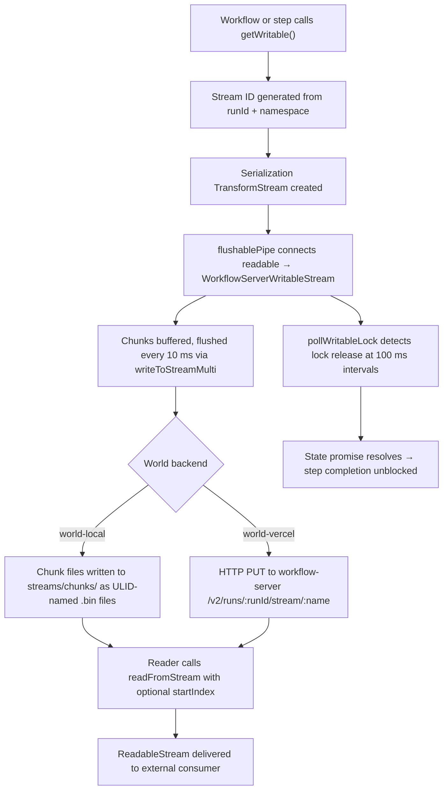

<Callout>
Durable streaming lets step functions write data that outlives any single function invocation. Chunks are persisted to the world backend as they arrive, so external consumers can read the stream even if the producing step suspends, crashes, or scales to zero. This mechanism powers real-time UI updates, progress reporting, and any scenario where a workflow needs to emit incremental results.
</Callout>

## Overview

A durable stream connects three layers:

1. **Handle creation** — workflow or step code calls `getWritable()` to obtain a `WritableStream` tied to the current run.
2. **Serialization and buffered flush** — chunks flow through a serialization transform, are batched in a `WorkflowServerWritableStream` buffer, and flushed to the world backend on a 10 ms timer.
3. **Persistence** — the world backend (`world-local` or `world-vercel`) stores each chunk as an individually addressable record that readers can consume from any index.

### Namespaced stream IDs

Every stream is identified by a deterministic ID derived from the workflow run ID. The function `getWorkflowRunStreamId` in `packages/core/src/util.ts` builds it:

```ts title="packages/core/src/util.ts" lineNumbers
// Format: strm_{ULID}_user_{base64url(namespace)?}
export function getWorkflowRunStreamId(runId: string, namespace?: string) {
  const streamId = `${runId.replace('wrun_', 'strm_')}_user`;
  if (!namespace) {
    return streamId;
  }
  const encodedNamespace = Buffer.from(namespace, 'utf-8').toString(
    'base64url'
  );
  return `${streamId}_${encodedNamespace}`;
}
```

When you call `getWritable({ namespace: 'progress' })`, the namespace is base64url-encoded and appended to the stream ID. This lets a single run own multiple independent streams without collision.

## Lifecycle



### Workflow-side handle creation

In **workflow code** (inside a `"use workflow"` function), `getWritable()` creates a lightweight handle — an object that carries a `STREAM_NAME_SYMBOL` property but does **not** set up any I/O pipeline:

```ts title="packages/core/src/workflow/writable-stream.ts" lineNumbers
export function getWritable<W = any>(
  options: WorkflowWritableStreamOptions = {}
): WritableStream<W> {
  const { namespace } = options;
  const name = (globalThis as any)[WORKFLOW_GET_STREAM_ID](namespace);
  return Object.create(globalThis.WritableStream.prototype, {
    [STREAM_NAME_SYMBOL]: {
      value: name,
      writable: false,
    },
  });
}
```

The `WORKFLOW_GET_STREAM_ID` symbol is injected into the sandboxed VM's `globalThis` by the workflow runtime (`packages/core/src/workflow.ts`). The returned object looks like a `WritableStream` but is really a serializable token — the framework's serialization layer recognizes `STREAM_NAME_SYMBOL` and reconstitutes a real writable on the step side.

### Step-side stream setup

In **step code** (inside a `"use step"` function or runtime context), `getWritable()` sets up the full I/O pipeline:

```ts title="packages/core/src/step/writable-stream.ts" lineNumbers
export function getWritable<W = any>(
  options: WorkflowWritableStreamOptions = {}
): WritableStream<W> {
  const ctx = contextStorage.getStore();
  if (!ctx) {
    throw new Error(
      '`getWritable()` can only be called inside a workflow or step function'
    );
  }

  const { namespace } = options;
  const runId = ctx.workflowMetadata.workflowRunId;
  const name = getWorkflowRunStreamId(runId, namespace);

  const serialize = getSerializeStream(
    getExternalReducers(globalThis, ctx.ops, runId, ctx.encryptionKey),
    ctx.encryptionKey
  );

  const serverWritable = new WorkflowServerWritableStream(name, runId);
  const state = createFlushableState();
  ctx.ops.push(state.promise);

  flushablePipe(serialize.readable, serverWritable, state).catch(() => {});
  pollWritableLock(serialize.writable, state);

  return serialize.writable;
}
```

Key points:

- A `TransformStream` handles serialization (and optional encryption).
- `flushablePipe` reads from the transform's readable side and writes to `WorkflowServerWritableStream`.
- `pollWritableLock` watches for the user releasing their writer lock so the step can complete without waiting for an explicit `.close()`.
- The `state.promise` is pushed onto `ctx.ops`, tying stream completion to step completion.

## Code Walkthrough

### Buffered writes in WorkflowServerWritableStream

`WorkflowServerWritableStream` (defined in `packages/core/src/serialization.ts`) batches chunks before sending them to the world:

```ts title="packages/core/src/serialization.ts (simplified)" lineNumbers
const STREAM_FLUSH_INTERVAL_MS = 10;

// Inside the constructor:
let buffer: Uint8Array[] = [];
let flushTimer: ReturnType<typeof setTimeout> | null = null;

const flush = async (): Promise<void> => {
  if (buffer.length === 0) return;
  const chunksToFlush = buffer.slice();

  if (typeof world.writeToStreamMulti === 'function' && chunksToFlush.length > 1) {
    await world.writeToStreamMulti(name, runId, chunksToFlush);
  } else {
    for (const chunk of chunksToFlush) {
      await world.writeToStream(name, runId, chunk);
    }
  }
  buffer = [];
};

// write() buffers a chunk and schedules a flush
async write(chunk) {
  buffer.push(chunk);
  scheduleFlush(); // arms a 10 ms setTimeout
  await new Promise<void>((resolve, reject) => {
    flushWaiters.push({ resolve, reject });
  });
}
```

The 10 ms batching window reduces network overhead: rapid successive writes are coalesced into a single `writeToStreamMulti` call. Each `write()` caller awaits the flush result, so `flushablePipe` correctly tracks pending operations.

### Lock polling and completion

The Web Streams API has no event for "lock released but stream still open." `flushable-stream.ts` bridges this gap with a 100 ms polling loop:

```ts title="packages/core/src/flushable-stream.ts (simplified)" lineNumbers
export const LOCK_POLL_INTERVAL_MS = 100;

export function pollWritableLock(
  writable: WritableStream,
  state: FlushableStreamState
): void {
  const intervalId = setInterval(() => {
    if (state.doneResolved || state.streamEnded) {
      clearInterval(intervalId);
      return;
    }
    if (isWritableUnlockedNotClosed(writable) && state.pendingOps === 0) {
      state.doneResolved = true;
      state.resolve();
      clearInterval(intervalId);
    }
  }, LOCK_POLL_INTERVAL_MS);
}
```

This means a step function can write to a stream, release the writer lock, and return — without explicitly closing the stream. The polling loop detects the unlock, waits for in-flight flushes to settle, then resolves the state promise so the step can complete. Without this mechanism, Vercel functions would hang until the runtime timeout because `.pipeTo()` only resolves on stream close.

### `flushablePipe` — the pump

`flushablePipe` is the core read-write loop that connects the serialization transform to the server writable. It tracks `pendingOps` to coordinate with the lock poller:

```ts title="packages/core/src/flushable-stream.ts (excerpt)" lineNumbers
export async function flushablePipe(
  source: ReadableStream,
  sink: WritableStream,
  state: FlushableStreamState
): Promise<void> {
  const reader = source.getReader();
  const writer = sink.getWriter();

  try {
    while (true) {
      const readResult = await reader.read();
      if (readResult.done) {
        state.streamEnded = true;
        await writer.close();
        if (!state.doneResolved) {
          state.doneResolved = true;
          state.resolve();
        }
        return;
      }
      state.pendingOps++;
      try {
        await writer.write(readResult.value);
      } finally {
        state.pendingOps--;
      }
    }
  } catch (err) {
    state.streamEnded = true;
    if (!state.doneResolved) {
      state.doneResolved = true;
      state.reject(err);
    }
    throw err;
  } finally {
    reader.releaseLock();
    writer.releaseLock();
  }
}
```

The dual resolution paths — stream-close via the pump loop and lock-release via polling — ensure the step completes promptly regardless of how the user finishes writing.

### Local persistence (world-local)

`packages/world-local/src/streamer.ts` persists each chunk as a binary file:

- **Path format:** `streams/chunks/{streamName}-chnk_{ULID}.bin`
- **Chunk format:** 1 byte EOF flag + payload bytes
- **Ordering:** Monotonic ULID generation ensures lexicographic sort equals chronological order
- **Multi-chunk batching:** `writeToStreamMulti` generates all ULIDs synchronously before any async I/O, preserving call order even when `runId` is a promise
- **EOF:** `closeStream` writes a zero-payload chunk with the EOF byte set to `1`
- **Run association:** A JSON file at `streams/runs/{runId}` tracks which stream IDs belong to a run

The reader (`readFromStream`) sets up event listeners **before** reading from disk, then reconciles disk state with buffered real-time events to avoid duplicates and maintain order.

### Production persistence (world-vercel)

`packages/world-vercel/src/streamer.ts` delegates to the Vercel workflow-server over HTTP:

- **Write:** `PUT /v2/runs/{runId}/stream/{name}` with the chunk as the request body
- **Multi-chunk write:** Same endpoint with an `X-Stream-Multi: true` header and a length-prefixed binary encoding (`encodeMultiChunks`)
- **Close:** `PUT` with an `X-Stream-Done: true` header and no body
- **Read:** `GET /v2/stream/{name}` returns a streaming response body; `startIndex` is supported as a query parameter
- **Chunk pagination:** `GET /v2/runs/{runId}/streams/{name}/chunks` supports `limit` and `cursor` parameters

The production backend does not use an in-process event emitter — the workflow-server handles chunk storage and real-time delivery to readers.

## Why This Matters

Durable streaming solves the fundamental tension between serverless execution (short-lived, stateless) and streaming output (long-lived, stateful):

- **Incremental results without blocking.** A step function can write progress updates, AI-generated tokens, or partial results that reach the UI immediately — even if the step later suspends and replays.
- **Automatic completion detection.** The lock-polling mechanism means step functions don't need explicit stream lifecycle management. Write your data, release the lock (or let it go out of scope), and the framework handles the rest.
- **Backend-agnostic persistence.** The same `getWritable()` call works identically against the local filesystem backend and the production HTTP backend. The `Streamer` interface in `@workflow/world` defines the contract; backends implement it.
- **Ordered, resumable reads.** Readers can start from any index and receive chunks in guaranteed ULID order. The local backend supports real-time subscriptions via `EventEmitter`; the production backend streams via HTTP response bodies.
- **Batched efficiency.** The 10 ms flush window and `writeToStreamMulti` support mean high-frequency writes don't generate one HTTP request per chunk — they're coalesced automatically.
