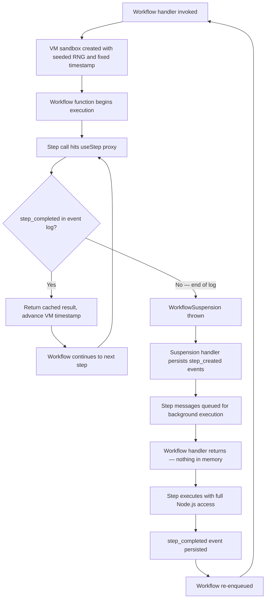

Every durable workflow framework has to answer one fundamental question: when the process crashes and restarts, how do you get back to where you were without doing everything over again?

Some frameworks checkpoint state into serialized blobs. Others require you to write explicit state machines. Workflow DevKit takes a different path: it lets you write ordinary `async`/`await` JavaScript, then splits your code into two execution contexts at compile time — one that orchestrates, and one that does work. The orchestration half replays from an event log. The work half never runs twice.

This article walks through exactly how that split works, from the directives you write in source code down to the suspension mechanics that make it all possible.

## The Two Directives

Workflow DevKit introduces two JavaScript directives that tell the compiler how to treat each function:

```ts
export async function createUser(email: string) {
  "use step";
  return { id: crypto.randomUUID(), email };
}

export async function handleUserSignup(email: string) {
  "use workflow";
  const user = await createUser(email);
  return { userId: user.id };
}
```

`"use workflow"` marks a function as a **deterministic orchestrator**. It decides what steps to run and in what order, but it cannot perform side effects directly — no API calls, no database writes, no file system access.

`"use step"` marks a function as a **side-effecting operation**. It has full Node.js runtime access: network, disk, environment variables, the works. Its return value is persisted to an append-only event log and cached for replay.

This is the entire API surface for the split. You don't need to learn a state machine DSL or decorate classes with metadata. You write functions, add a directive string, and the compiler handles the rest.

## What the Compiler Does

The SWC compiler plugin runs three transform passes over every workflow file. The one that matters most for understanding the execution model is the **workflow mode** transform.

In workflow mode, step function bodies are replaced with proxy calls through a well-known symbol. The entire function declaration is replaced with a variable assignment:

```ts
// Workflow mode output — step function replaced entirely
export var createUser = globalThis[Symbol.for("WORKFLOW_USE_STEP")](
  "step//./workflows/user//createUser"
);

export async function handleUserSignup(email: string) {
  // Workflow body stays intact
  const user = await createUser(email);
  return { userId: user.id };
}
handleUserSignup.workflowId = "workflow//./workflows/user//handleUserSignup";
globalThis.__private_workflows.set(
  "workflow//./workflows/user//handleUserSignup",
  handleUserSignup
);
```

`WORKFLOW_USE_STEP` returns a function — so `await createUser(email)` still works. The step ID (`"step//./workflows/user//createUser"`) is derived from the file path and function name at build time — it's stable across deployments and deterministic across replays.

At runtime, the `WORKFLOW_USE_STEP` symbol is bound to the `useStep` function from the core runtime:

```ts
// From packages/core/src/workflow.ts
const useStep = createUseStep(workflowContext);
vmGlobalThis[WORKFLOW_USE_STEP] = useStep;
```

When workflow code calls `await createUser(email)`, it's calling the function returned by the proxy, which checks the event log for a cached result or suspends execution if the step hasn't run yet.

## Inside the Sandbox

Workflow functions execute inside a Node.js VM context — not in your normal runtime. This sandbox is created by `createContext()` in `packages/core/src/vm/index.ts`, and it replaces every source of non-determinism with a seeded, reproducible alternative.

The seed is derived from three values that are identical on every replay of the same run:

```ts
// From packages/core/src/workflow.ts
const {
  context,
  globalThis: vmGlobalThis,
  updateTimestamp,
} = createContext({
  seed: `${workflowRun.runId}:${workflowRun.workflowName}:${+startedAt}`,
  fixedTimestamp: +startedAt,
});
```

Here's what gets replaced inside the VM:

### Math.random()

```ts
const rng = seedrandom(seed);
g.Math.random = rng;
```

Every call to `Math.random()` returns the next value from a seeded PRNG. Same seed, same sequence, every time. If your workflow uses randomness for ID generation, load balancing, or jitter — it produces identical results on replay.

### Date.now() and new Date()

```ts
const Date_ = g.Date;
(g as any).Date = function Date(
  ...args: Parameters<(typeof globalThis)['Date']>[]
) {
  if (args.length === 0) {
    return new Date_(fixedTimestamp);
  }
  return new Date_(...args);
};
g.Date.now = () => fixedTimestamp;
```

Time doesn't advance with wall-clock time inside the workflow. Instead, `fixedTimestamp` advances only when events are consumed from the log:

```ts
// From packages/core/src/workflow.ts
workflowContext.eventsConsumer.subscribe((event) => {
  const createdAt = event?.createdAt;
  if (createdAt) {
    updateTimestamp(+createdAt);
  }
  return EventConsumerResult.NotConsumed;
});
```

This means the workflow experiences time progressing through the event log — not through real elapsed time. A workflow that took 3 hours to complete will replay in milliseconds, but `Date.now()` inside that workflow will still return the correct timestamps at each decision point.

### crypto.getRandomValues() and crypto.randomUUID()

Both use the same seeded RNG, so UUIDs generated inside workflow functions are deterministic and reproducible.

### Disallowed globals

`fetch`, `setTimeout`, `setInterval`, and other non-deterministic APIs throw helpful errors directing you to use step functions instead. `process.env` is available as a frozen snapshot — readable but not writable.

## The Suspension Mechanism

Here's where the model gets interesting. When a workflow reaches a step that hasn't completed yet, it doesn't block or poll. It **suspends**.

The `useStep` proxy created by `createUseStep()` in `packages/core/src/step.ts` subscribes to the `EventsConsumer` for each step call. When the consumer reaches the end of the log without finding a matching `step_completed` event, it triggers a suspension:

```ts
// From packages/core/src/step.ts
if (!event) {
  // End of the event log — this step hasn't completed yet.
  // The Promise never resolves, stopping workflow execution.
  scheduleWhenIdle(ctx, () => {
    ctx.onWorkflowError(
      new WorkflowSuspension(ctx.invocationsQueue, ctx.globalThis)
    );
  });
  return EventConsumerResult.NotConsumed;
}
```

The `WorkflowSuspension` collects all pending operations — steps, hooks, and waits — and propagates up through the call stack:

```ts
// From packages/core/src/workflow.ts
try {
  const result = await Promise.race([
    workflowFn(...args),
    workflowDiscontinuation.promise,
  ]);
  // Workflow completed
} catch (err) {
  if (WorkflowSuspension.is(err)) {
    throw err; // Propagated to suspension handler
  }
  throw err;
}
```

The suspension handler in `packages/core/src/runtime/suspension-handler.ts` then processes the pending queue in a specific order:

1. **Hooks first** — webhook receivers are created before steps to prevent race conditions
2. **Steps and waits in parallel** — each step gets a `step_created` event persisted and a message queued for background execution
3. **Timeout calculation** — if any waits exist, the minimum `resumeAt` time determines when the workflow re-enqueues

After suspension handling completes, the workflow handler returns. Nothing stays in memory. The event log is the complete state.

## Replay: Orchestration Re-runs, Side Effects Don't

When a step completes in the background, the workflow is re-enqueued. It starts from the beginning — same code, same seed, same starting timestamp — and replays through the event log.

This is where the split pays off. The `EventsConsumer` feeds events to subscribers in order. When the `useStep` proxy encounters a `step_completed` event for the current step, it returns the cached result immediately:

```ts
// From packages/core/src/step.ts
if (event.eventType === 'step_completed') {
  ctx.invocationsQueue.delete(event.correlationId);

  ctx.pendingDeliveries++;
  ctx.promiseQueue = ctx.promiseQueue.then(async () => {
    try {
      const hydratedResult = await hydrateStepReturnValue(
        event.eventData.result,
        ctx.runId,
        ctx.encryptionKey,
        ctx.globalThis
      );
      resolve(hydratedResult as Result);
    } catch (error) {
      reject(error);
    } finally {
      ctx.pendingDeliveries--;
    }
  });
  return EventConsumerResult.Finished;
}
```

The promise queue ensures results are delivered in event log order, even if deserialization takes variable time. The workflow code sees exactly the same values it would have seen on the first execution — same step results, same `Date.now()` values, same `Math.random()` sequence.

<Callout>
Replay re-runs the orchestration logic — the workflow function — but it never re-runs the side effects. Step functions that call APIs, write to databases, or send emails execute exactly once. On replay, the workflow receives their cached results from the event log.
</Callout>

## The Lifecycle: A Complete Picture



A workflow with 10 steps will invoke the workflow handler up to 10 times — once for each new step. But each invocation replays all previously completed steps from cache in milliseconds, then suspends at the next uncompleted step. The total compute cost is proportional to the orchestration logic, not the step execution time.

## Before and After: Always-On vs. Suspend/Resume

Consider a traditional always-on worker processing a multi-step order pipeline — charge the card, reserve inventory, send a confirmation email, then wait for shipping confirmation from a third-party API.

**Always-on orchestration:**
- A worker process stays alive for the entire workflow duration. If the shipping API takes 6 hours to respond, the worker sits idle for 6 hours holding a connection, memory, and a compute slot.
- If the process crashes between steps — say, after charging the card but before reserving inventory — you need explicit checkpointing, idempotency keys, and manual retry logic to avoid double-charging.
- Scaling means provisioning enough persistent workers to handle peak concurrency. Each worker is occupied for the full lifetime of the workflow it's running, regardless of how much time is spent waiting vs. computing.
- Error handling is defensive: you wrap every step in try/catch, manage partial failure states, and hope your checkpoint logic covers every edge case.

**Workflow DevKit's suspend/resume model:**
- The workflow handler runs only during replay and suspension — typically milliseconds per invocation. Between steps, nothing is in memory. The event log is the complete state.
- Crashes are invisible to the developer. If the process dies after charging the card, the `step_completed` event for the charge is already in the log. On re-enqueue, the workflow replays through that cached result and suspends at the next uncompleted step — no double-charge, no manual recovery code.
- Steps execute as individual queued messages that can run on any available compute. A workflow with 100 concurrent steps doesn't need 100 workers — the queue distributes work across whatever capacity is available.
- Error handling is built into the model: `RetryableError` triggers automatic retries with backoff; `FatalError` terminates the step permanently. The orchestration code doesn't need try/catch around step calls unless you want to handle failures as part of the workflow logic.

The difference is most dramatic for workflows with long waits. A workflow that sends an email and waits 3 days for a customer response costs exactly zero compute during those 3 days. No worker. No connection. No memory. When the response arrives (via a webhook or scheduled poll), the workflow replays from the event log — milliseconds of compute — processes the response in a step, and either completes or suspends again at the next pending operation.

## Writing Workflow Code: Practical Implications

Understanding the execution model changes how you write code:

**Inside `"use workflow"` functions:**
- `Math.random()`, `Date.now()`, and `crypto.randomUUID()` are safe — they're deterministic
- Don't call `fetch`, `setTimeout`, or any I/O — the sandbox will throw
- Use `await` and `Promise.all()` / `Promise.race()` freely — they work as expected
- Every execution path must be deterministic given the same event history

**Inside `"use step"` functions:**
- Full Node.js access — call APIs, query databases, write files
- Return values must be serializable (they're persisted to the event log)
- Each step executes exactly once, even across crashes and replays
- Use `FatalError` for permanent failures, `RetryableError` for transient ones

The boundary between the two contexts is the only thing you need to think about. Everything else — suspension, replay, event log management, timestamp advancement — is handled by the runtime.

## Conclusion

The step execution model is the foundation that makes Workflow DevKit's other properties possible. Durability comes from the event log. Replay comes from deterministic orchestration. Cost efficiency comes from suspension. And all of it traces back to a single architectural decision: split the code into what orchestrates and what does work, then make the orchestration half perfectly reproducible.

Two directives. One split. That's the entire model.
