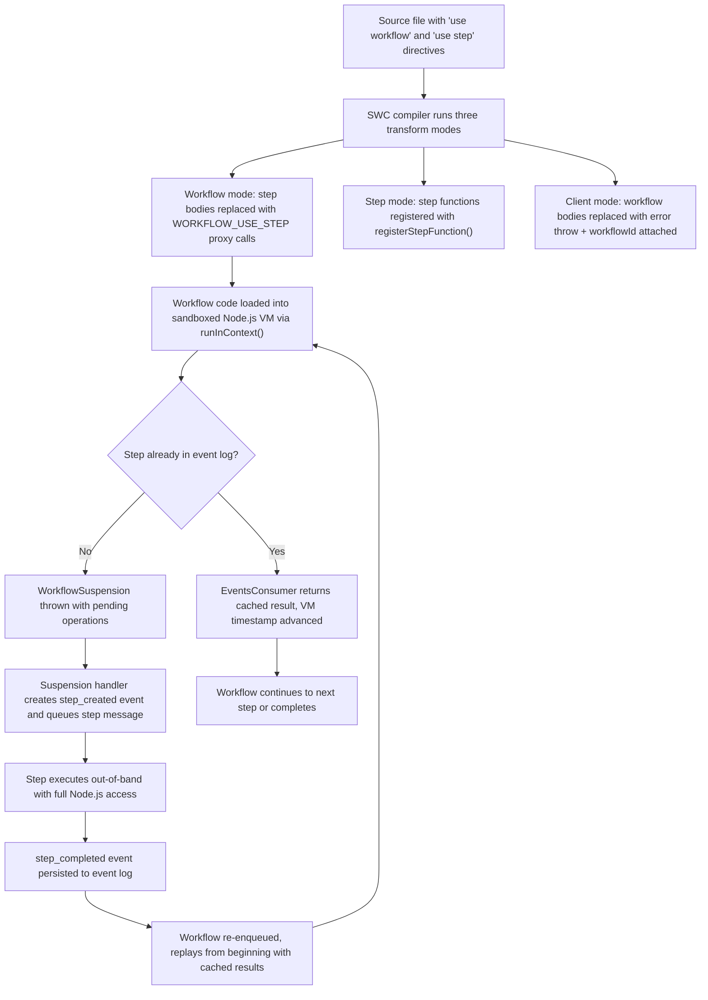

<Callout>
The step execution model is the mechanism that makes durable workflows possible. It lets you write ordinary `async`/`await` code while the runtime transparently handles suspension, background step execution, and deterministic replay. Understanding this model explains why workflow functions run in a sandbox, why `Math.random()` and `Date.now()` are deterministic, and how cached step results enable replay without re-executing side effects.
</Callout>

## Overview

Workflow DevKit separates code into two execution contexts using JavaScript directives:

- **Workflow functions** (`"use workflow"`) — deterministic orchestrators that run inside a sandboxed Node.js VM. They coordinate which steps to run and in what order, but cannot perform side effects directly.
- **Step functions** (`"use step"`) — side-effecting operations with full Node.js runtime access. They run outside the VM, and their results are persisted to the event log.

The compiler transforms a single source file into separate bundles for each context. At runtime, the workflow VM calls steps through a symbol-based proxy (`WORKFLOW_USE_STEP`) that either returns a cached result from the event log or suspends the workflow and enqueues the step for background execution.

## Lifecycle



## Code Walkthrough

### Deterministic VM context

When a workflow run executes, `createContext()` in `packages/core/src/vm/index.ts` builds a sandboxed environment where all sources of non-determinism are replaced with seeded, reproducible alternatives. The seed is derived from the run ID, workflow name, and start timestamp — so every replay of the same run produces identical values:

```ts title="packages/core/src/vm/index.ts" lineNumbers
export function createContext(options: CreateContextOptions) {
  let { fixedTimestamp } = options;
  const { seed } = options;
  const rng = seedrandom(seed);
  const context = vmCreateContext();

  const g: typeof globalThis = runInContext('globalThis', context);

  // Deterministic `Math.random()`
  g.Math.random = rng;

  // Override `Date` constructor to return fixed time when called without arguments
  const Date_ = g.Date;
  (g as any).Date = function Date(
    ...args: Parameters<(typeof globalThis)['Date']>[]
  ) {
    if (args.length === 0) {
      return new Date_(fixedTimestamp);
    }
    return new Date_(...args);
  };
  (g as any).Date.prototype = Date_.prototype;
  Object.setPrototypeOf(g.Date, Date_);
  g.Date.now = () => fixedTimestamp;

  // ... crypto.getRandomValues and crypto.randomUUID also use rng

  return {
    context,
    globalThis: g,
    updateTimestamp: (timestamp: number) => {
      fixedTimestamp = timestamp;
    },
  };
}
```

Key properties of the sandbox:

- **`Math.random()`** is replaced with a seeded PRNG (`seedrandom`). The seed is `${runId}:${workflowName}:${+startedAt}`, making the sequence identical across replays.
- **`Date.now()`** and `new Date()` return a fixed timestamp that advances only when events are consumed from the log (via `updateTimestamp`).
- **`crypto.getRandomValues()`** and **`crypto.randomUUID()`** use the same seeded RNG.
- **`fetch`**, **`setTimeout`**, **`setInterval`**, and other non-deterministic globals throw helpful errors directing developers to use step functions or `sleep()` instead.
- **`process.env`** is provided as a frozen snapshot — readable but not mutable.

### WORKFLOW_USE_STEP transformation

The SWC compiler transforms step function bodies in workflow mode into proxy calls through a well-known symbol. Given this source:

```ts title="Source" lineNumbers
export async function createUser(email: string) {
  "use step";
  return { id: crypto.randomUUID(), email };
}

export async function handleUserSignup(email: string) {
  "use workflow";
  const user = await createUser(email);
  return { userId: user.id };
}
```

The workflow-mode output replaces the step body:

```ts title="Workflow mode output" lineNumbers
export async function createUser(email: string) {
  // Step body replaced — calls the runtime's useStep proxy
  return globalThis[Symbol.for("WORKFLOW_USE_STEP")](
    "step//workflows/user.js//createUser"
  )(email);
}

export async function handleUserSignup(email: string) {
  // Workflow body stays intact — it's deterministic orchestration
  const user = await createUser(email);
  return { userId: user.id };
}
handleUserSignup.workflowId = "workflow//workflows/user.js//handleUserSignup";
```

At runtime, the `WORKFLOW_USE_STEP` symbol is bound to the `useStep` function created in `packages/core/src/workflow.ts`:

```ts title="packages/core/src/workflow.ts (simplified)" lineNumbers
const useStep = createUseStep(workflowContext);

// Injected into the VM's globalThis
vmGlobalThis[WORKFLOW_USE_STEP] = useStep;
```

When the workflow calls `await createUser(email)`, the proxy checks the `EventsConsumer` for a matching `step_completed` event. If found, it returns the cached result. If not found, it adds the step to the invocations queue and eventually throws a `WorkflowSuspension`.

### Suspension and step dispatch

When a workflow reaches a step that hasn't been executed yet, execution doesn't block — it **suspends**. The `WorkflowSuspension` collects all pending operations (steps, hooks, waits) and propagates up to the runtime:

```ts title="packages/core/src/workflow.ts (execution)" lineNumbers
try {
  const result = await Promise.race([
    workflowFn(...args),
    workflowDiscontinuation.promise,
  ]);
  // ... workflow completed successfully
} catch (err) {
  if (WorkflowSuspension.is(err)) {
    throw err; // Propagated to the suspension handler
  }
  throw err;
}
```

The suspension handler in `packages/core/src/runtime/suspension-handler.ts` then processes the pending queue:

1. **Hooks first** — created before steps to prevent race conditions with webhook receivers
2. **Steps and waits in parallel** — each step gets a `step_created` event and a queued message for background execution
3. **Timeout calculation** — if any waits exist, the minimum `resumeAt` time determines when the workflow should be re-enqueued

### Replay with timestamp advancement

On replay, the `EventsConsumer` feeds events to registered callbacks. A passive subscriber advances the VM's clock as events are consumed:

```ts title="packages/core/src/workflow.ts (timestamp subscriber)" lineNumbers
workflowContext.eventsConsumer.subscribe((event) => {
  const createdAt = event?.createdAt;
  if (createdAt) {
    updateTimestamp(+createdAt);
  }
  return EventConsumerResult.NotConsumed;
});
```

This means `Date.now()` inside the workflow returns the timestamp of the most recently consumed event — not wall-clock time. The workflow experiences time progressing through the event log, making temporal logic consistent across replays.

## Why This Matters

The split execution model delivers three properties that enable durable workflows on stateless compute:

1. **Zero re-execution cost** — Step results are cached in the event log. Replay never re-runs a step; it reads the cached result and continues. A workflow with 50 completed steps replays in milliseconds.

2. **Deterministic orchestration** — The sandboxed VM guarantees that workflow code produces the same decisions given the same event history. This makes replay safe: the workflow will always arrive at the same suspension point or completion.

3. **Stateless suspension** — When a workflow suspends, nothing stays in memory. The event log is the complete state. The workflow can resume on any machine, in any process, at any time — and produce the same result.
