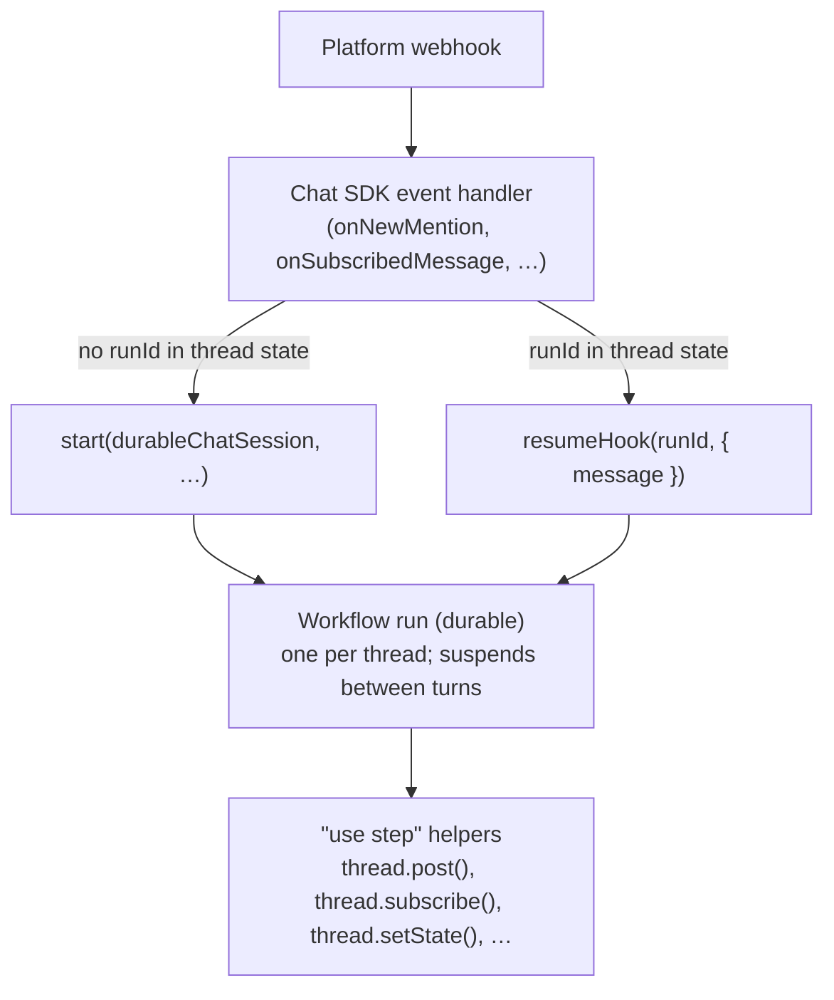

[Chat SDK](https://chat-sdk.dev/) is a unified TypeScript SDK for building bots across Slack, Microsoft Teams, Google Chat, Discord, Telegram, GitHub, Linear, and WhatsApp. Write the bot once, deploy to every platform. It handles webhook verification, event normalization, subscriptions, and cross-platform features like cards and modals.

Workflow SDK complements it by making bot **sessions** durable. Each conversation thread maps to a long-running workflow run that:

- Owns multi-turn state in the durable event log instead of Redis-by-hand bookkeeping
- Can `sleep()` for hours or days waiting for a user reply, an approval, or a scheduled follow-up
- Survives deploys, cold starts, and crashes — the session picks up from the last step on replay
- Receives follow-up messages via hooks, so the bot stays responsive while the workflow is still running

The rest of this page covers the integration pattern. For a full Slack + Next.js + Redis walkthrough, see the [Durable chat sessions guide](https://chat-sdk.dev/docs/guides/durable-chat-sessions-nextjs) on chat-sdk.dev.

## How It Fits Together

Chat SDK owns the edge — webhook verification, event routing, `thread.post()` / `thread.stream()`. Workflow owns the session — state, loops, sleeps, retries. They meet at exactly two points:



- **Inbound** — Chat SDK handlers decide whether to `start(workflow, [thread, message])` or `resumeHook(runId, { message })`. The `runId` lives in Chat SDK's thread state (Redis, Postgres, or any state adapter).
- **Outbound** — the workflow calls Chat SDK APIs (`thread.post()`, `thread.subscribe()`, `thread.setState()`) from inside step functions. Never from the top level of a workflow file — adapter packages use Node-only modules that aren't available in the workflow sandbox.

## Why Workflow + Chat SDK

Without Workflow, a long-running bot session usually means one of:
- Holding a webhook request open while the agent runs (doesn't survive restarts, blows past platform timeouts)
- Writing session state to Redis manually, plus a scheduler for timeouts and retries, plus custom reconnection logic

Workflow replaces all of that with a single durable function. The bot can:

- Run a tool loop for minutes while the user watches typing indicators
- Wait for a human approval in another thread before continuing
- Schedule a follow-up message 24 hours later via `sleep("24h")`
- Pause on sandbox snapshot, resume when the user sends the next command (see the [Sandbox integration](/docs/cookbook/integrations/sandbox))

Because the session *is* a workflow run, its history is recoverable from the event log — no separate message store to keep in sync.

## The Pattern: One Thread = One Workflow Run

Three files. The bot definition is separate from the workflow so adapter packages stay out of the workflow sandbox.

<Tabs items={['Bot Setup', 'Workflow', 'Event Handlers']}>

<Tab value="Bot Setup">

Register the `Chat` instance as a singleton so step functions can dynamically import it and resolve adapters + state:

```typescript title="lib/bot.ts" lineNumbers
import { Chat } from "chat";
import { createSlackAdapter } from "@chat-adapter/slack";
import { createRedisState } from "@chat-adapter/state-redis";

const adapters = {
  slack: createSlackAdapter(),
};

export interface ThreadState {
  runId?: string; // [!code highlight]
}

export const bot = new Chat<typeof adapters, ThreadState>({
  userName: "durable-bot",
  adapters,
  state: createRedisState(),
  dedupeTtlMs: 600_000,
}).registerSingleton(); // [!code highlight]
```

`registerSingleton()` is important: Chat SDK re-hydrates `Thread` objects inside step functions, and it needs a registered singleton to resolve adapters and state for those rehydrated instances.

</Tab>

<Tab value="Workflow">

The workflow is a plain loop over a hook. It receives the serialized thread + first message from the handler, revives them via Chat SDK's standalone `reviver`, and every platform-side effect goes inside a `"use step"` helper:

```typescript title="workflows/durable-chat-session.ts" lineNumbers
import { Message, reviver, type Thread } from "chat";
import { defineHook, getWorkflowMetadata } from "workflow";
import type { ThreadState } from "@/lib/bot";

// Hook payload lives in its own file so the webhook side can import it without
// pulling in the workflow module.
import type { ChatTurnPayload } from "@/workflows/chat-turn-hook";

const chatTurnHook = defineHook<ChatTurnPayload>(); // [!code highlight]

async function postAssistantMessage(
  thread: Thread<ThreadState>,
  text: string
) {
  "use step";
  // Dynamic import keeps adapter packages out of the workflow sandbox.
  const { bot } = await import("@/lib/bot"); // [!code highlight]
  await bot.initialize();
  await thread.post(text);
}

async function runTurn(text: string) {
  "use step";
  // Your AI SDK call, database lookup, tool loop, etc.
  return `You said: ${text}`;
}

async function handleMessage(
  thread: Thread<ThreadState>,
  message: Message
) {
  const text = message.text.trim();
  if (text.toLowerCase() === "done") return false;

  const reply = await runTurn(text);
  await postAssistantMessage(thread, reply);
  return true;
}

export async function durableChatSession(payload: string) {
  "use workflow";

  const { workflowRunId } = getWorkflowMetadata();
  const { thread, message } = JSON.parse(payload, reviver) as { // [!code highlight]
    thread: Thread<ThreadState>;
    message: Message;
  };

  const hook = chatTurnHook.create({ token: workflowRunId });

  await postAssistantMessage(thread, "Session started. Reply here; send `done` to stop.");

  if (!(await handleMessage(thread, message))) return;

  // Each hook resumption is one turn. The workflow stays suspended between
  // messages — zero compute cost while idle.
  while (true) {
    const { message: nextRaw } = await hook; // [!code highlight]
    const next = Message.fromJSON(nextRaw);
    if (!(await handleMessage(thread, next))) return;
  }
}
```

```typescript title="workflows/chat-turn-hook.ts" lineNumbers
import type { SerializedMessage } from "chat";

export type ChatTurnPayload = {
  message: SerializedMessage;
};
```

</Tab>

<Tab value="Event Handlers">

Handlers live outside the workflow file so adapter dependencies don't leak in. They decide whether to start a new workflow or resume an existing one, then store the `runId` in thread state:

```typescript title="lib/chat-session-handlers.ts" lineNumbers
import type { Message, Thread } from "chat";
import { getRun, resumeHook, start } from "workflow/api";
import { bot, type ThreadState } from "@/lib/bot";
import { durableChatSession } from "@/workflows/durable-chat-session";
import type { ChatTurnPayload } from "@/workflows/chat-turn-hook";

async function startSession(thread: Thread<ThreadState>, message: Message) {
  const run = await start(durableChatSession, [ // [!code highlight]
    JSON.stringify({
      thread: thread.toJSON(),
      message: message.toJSON(),
    }),
  ]);
  await thread.setState({ runId: run.runId });
}

async function routeTurn(thread: Thread<ThreadState>, message: Message) {
  const state = await thread.state;

  // No run yet, or the previous run finished — start fresh.
  if (!state?.runId || !(await getRun(state.runId).exists)) {
    await startSession(thread, message);
    return;
  }

  try {
    await resumeHook<ChatTurnPayload>(state.runId, { // [!code highlight]
      message: message.toJSON(),
    });
  } catch (err) {
    const msg = err instanceof Error ? err.message.toLowerCase() : "";
    if (msg.includes("not found") || msg.includes("expired")) {
      // Stale runId — start a new session rather than dropping the message.
      await startSession(thread, message);
      return;
    }
    throw err;
  }
}

bot.onNewMention(async (thread, message) => {
  await thread.subscribe();
  await routeTurn(thread, message);
});

bot.onSubscribedMessage(async (thread, message) => {
  await routeTurn(thread, message);
});
```

Wire Chat SDK's webhook handler into a catch-all route. Importing `chat-session-handlers` for side effects registers the event handlers before the first webhook arrives:

```typescript title="app/api/webhooks/[platform]/route.ts" lineNumbers
import "@/lib/chat-session-handlers";
import { after } from "next/server";
import { bot } from "@/lib/bot";

type Platform = keyof typeof bot.webhooks;

export async function POST(
  req: Request,
  { params }: { params: Promise<{ platform: string }> }
) {
  const { platform } = await params;
  const handler = bot.webhooks[platform as Platform];
  if (!handler) return new Response(`Unknown platform: ${platform}`, { status: 404 });

  return handler(req, { waitUntil: (task) => after(() => task) }); // [!code highlight]
}
```

</Tab>

</Tabs>

## How It Works

1. **Thread state stores the `runId`.** Chat SDK's state adapter (Redis, Postgres, memory) holds `{ runId }` per thread. That's the only piece of glue between the two SDKs.
2. **First mention → `start()`.** Handler serializes `thread` + `message` with `toJSON()`, passes them through `start(durableChatSession, [payload])`, stashes the returned `runId` in thread state.
3. **Subsequent messages → `resumeHook()`.** Handler looks up the `runId`, serializes the new message, and resumes the workflow's hook. The workflow picks up on the next `await hook` iteration.
4. **Workflow posts back via steps.** All Chat SDK side effects (`thread.post`, `thread.subscribe`, `thread.setState`) happen inside `"use step"` helpers that dynamically import the bot. This keeps adapter packages outside the workflow sandbox.
5. **Session ends — two ways.** The workflow returns normally (user said `done`, approval granted, etc.), or the workflow throws. Either way the run completes; the next inbound message with the stale `runId` falls through to `startSession()`.

The workflow is fully durable between turns: `await hook` suspends with zero compute cost, and platform webhooks can fire from anywhere without concern for which server instance handled the previous turn.

## Extending the Pattern

Because the session is just a workflow, everything else from the cookbook composes naturally:

- **Stream AI SDK responses into the thread.** Use the [AI SDK integration](/docs/cookbook/integrations/ai-sdk) pattern inside a step, then pass `result.fullStream` to `thread.post()` — Chat SDK handles platform-specific streaming (Slack edit-in-place, Telegram message-per-chunk, etc.).
- **Give the bot a sandbox.** Combine with the [Sandbox integration](/docs/cookbook/integrations/sandbox): each thread gets its own persistent sandbox session, snapshots on idle, resumes on the next message. That's effectively a coding-agent bot.
- **Human-in-the-loop approvals.** `Promise.race([hook, approvalHook])` inside the workflow, post buttons in the thread via [cards](https://chat-sdk.dev/docs/cards), resume `approvalHook` from `bot.onAction(...)`.
- **Scheduled follow-ups.** `sleep("24h")` before a proactive check-in. Surviving restarts is free.

## Pitfalls

### Don't import the bot at the top of workflow files

Adapter packages (`@chat-adapter/slack`, `@chat-adapter/telegram`, etc.) depend on Node-only modules that aren't available in the workflow bundler's sandbox. Keep `import { bot } from "@/lib/bot"` inside `"use step"` functions with `await import(...)`. Use `reviver` from `chat` for deserialization inside the workflow — it's standalone and has no adapter dependencies.

### Register the bot as a singleton

`new Chat({...}).registerSingleton()`. Chat SDK rehydrates `Thread` objects inside step functions via `reviver`, and it looks up adapters + state from the registered singleton. Without it, thread methods throw when called from step contexts.

### Hook payloads must be JSON-serializable

`Message` and `Thread` have methods, so pass them through `.toJSON()` / `Message.fromJSON()` across the hook boundary. Define a `ChatTurnPayload` type in its own file so both the webhook handler (in the Node bundle) and the workflow (in the workflow sandbox) can share it without dragging in adapter code.

### Handle stale `runId`s

A workflow run ends but its `runId` is still cached in thread state. The next message calls `resumeHook` on a dead run and throws `not found` / `expired`. Gate on `getRun(runId).exists` before resuming, or catch the error and fall through to `startSession`. Either way the user's message must not be dropped.

### Keep the hook outside the loop

One `chatTurnHook.create({ token: workflowRunId })` per workflow run, reused every iteration. Creating a new hook with the same token throws `HookConflictError`. This is the same rule as the [AI SDK](/docs/cookbook/integrations/ai-sdk) and [Sandbox](/docs/cookbook/integrations/sandbox) session patterns.

### Platform timeouts are separate from workflow timeouts

Slack wants a 200 within 3 seconds. The webhook handler returns immediately after `resumeHook` (which is fast) — the workflow then runs in the background and posts back via `thread.post`. Don't try to `await` the whole turn inside the webhook handler; that's what breaks in the naive integration.

## Key APIs

- [`Chat`](https://chat-sdk.dev/docs/api/chat) / [`Thread`](https://chat-sdk.dev/docs/api/thread) / [`Message`](https://chat-sdk.dev/docs/api/message) — Chat SDK primitives. `toJSON()` / `fromJSON()` / `reviver` are the serialization layer.
- [`start()`](/docs/api-reference/workflow-api/start) — start a new session workflow. Store the returned `runId` in thread state.
- [`resumeHook()`](/docs/api-reference/workflow-api/resume-hook) — forward a new platform message to the running workflow.
- [`getRun()`](/docs/api-reference/workflow-api/get-run) — `run.exists` before resuming, to detect stale `runId`s.
- [`defineHook()`](/docs/api-reference/workflow/define-hook) — per-turn suspension point inside the workflow.
- [`registerSingleton()`](https://chat-sdk.dev/docs/api/chat) — makes the bot resolvable from inside step functions.
