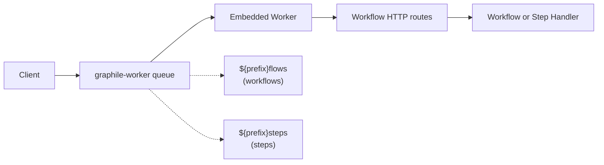

# How PostgreSQL World Works

This document explains the architecture and components of the PostgreSQL world implementation for workflow management.

This implementation is using [Drizzle Schema](./src/drizzle/schema.ts) that can be pushed or migrated into your PostgreSQL schema and backed by Postgres.js.

If you want to use any other ORM, query builder or underlying database client, you should be able to fork this implementation and replace the Drizzle parts with your own.

## Job Queue System



Jobs include retry logic (3 attempts), idempotency keys, durable delayed rescheduling, and configurable worker concurrency (default: 10).

## Streaming

Real-time data streaming via **PostgreSQL LISTEN/NOTIFY**:

- Stream chunks stored in `workflow_stream_chunks` table
- `pg_notify` triggers sent on writes to `workflow_event_chunk` topic
- Subscribers receive notifications and fetch chunk data
- ULID-based ordering ensures correct sequence
- Single connection for listening to notifications, with an in-process EventEmitter for distributing events to multiple subscribers

## Setup

Call `world.start()` to initialize graphile-worker workers. When `.start()` is called, workers begin listening to graphile-worker queues. When a job arrives, the worker executes the queue message over the workflow HTTP routes and awaits completion before acknowledging the Graphile job.

When the runtime returns `{ timeoutSeconds }`, the worker schedules a new Graphile job with a future `runAt` time before finishing the current task.

The worker targets the HTTP-compatible workflow endpoints directly: `.well-known/workflow/v1/flow` for workflows and `.well-known/workflow/v1/step` for steps.


In **Next.js**, the `world.start()` call needs to be added to `instrumentation.ts|js` to ensure workers start before request handling. Use `workflow/runtime` for `getWorld` (same as the testing server and other framework plugins):

```ts
// instrumentation.ts

if (process.env.NEXT_RUNTIME !== "edge") {
  import("workflow/runtime").then(async ({ getWorld }) => {
    // start listening to the jobs.
    await getWorld().start?.();
  });
}
```
